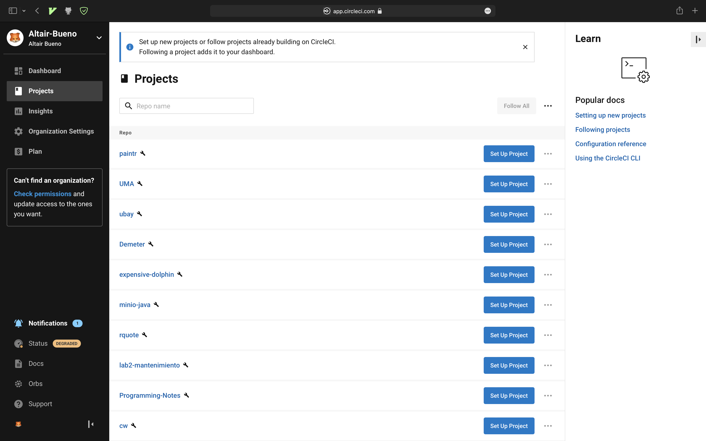
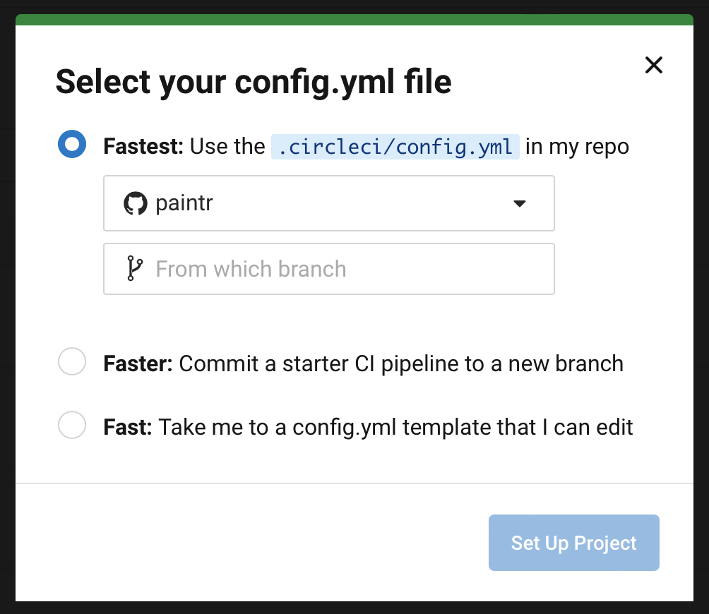
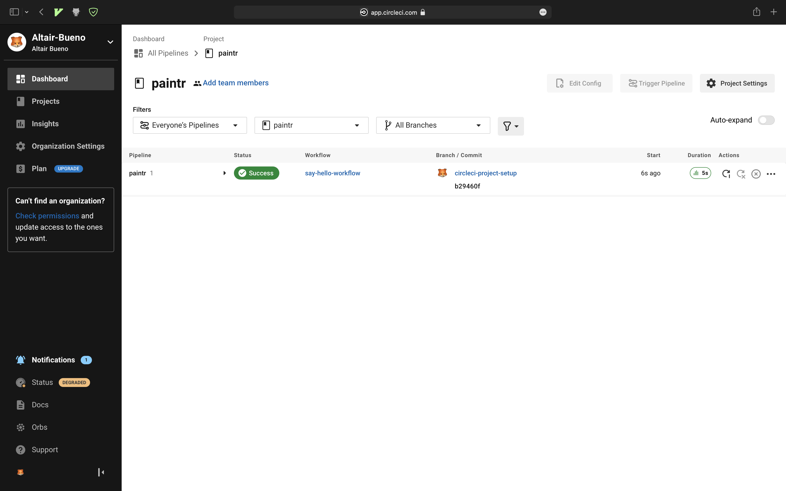
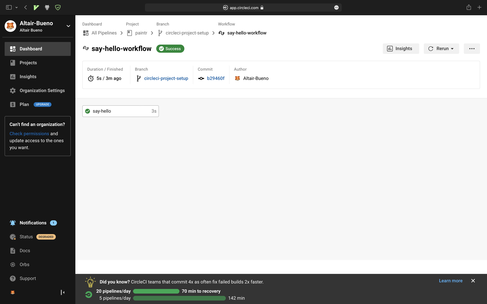
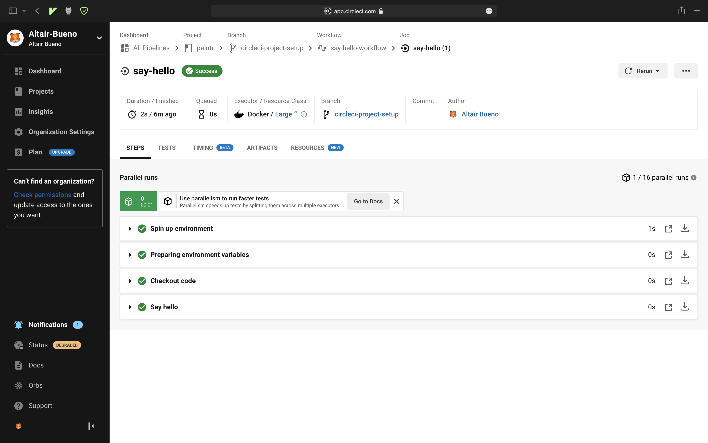
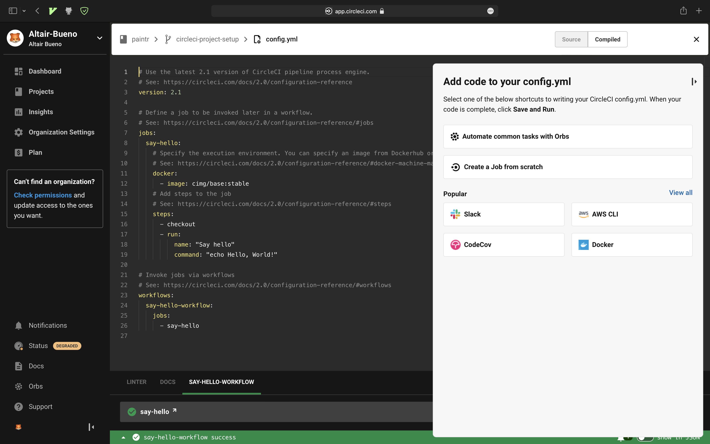

# Servicios de CI/CD

---

# Circle CI

---

<!--
Cuando inicias sesión o te registras utilizando GiHub o BitBucket, esta es la
pestaña principal que se presenta. Puedes ver todos los repositorios de la
organización y gestionar sus runners
-->

---

- **Fastest**: Utiliza un fichero ya existente en el repo
- **Faster**: Crea una rama `circleci-project-setup` con un fichero
  `.circleci/config.yml`
- **Fast**: Te permite configurar el fichero `.circleci/config.yml` de forma
  similar a GitHub Actions

---

---

---

---

# `config.yml`

---

- Fichero de configuración en formato YAML
- Puede estar ubicado en cualquier rama del repositorio, pero obligatoriamente
  dentro de la carpeta `.circleci`
- Podemos editar el fichero sin abandonar la web

---

---

# Planes y precios

Fuente: https://circleci.com/pricing/

---

---

|             | Hardware\*  | Creditos | Usuarios    | Precio     | Público objetivo           |
| ----------- | ----------- | -------- | ----------- | ---------- | -------------------------- |
| Free \*\*   | VMs         | 30.000   | 1           | Gratis     | Desarrolladores            |
| Performance | VMs + macOS | 55.000   | 5 gratuitos | Desde \$15 | Pequeñas empresas          |
| Scale       | Todo        | Custom   | Custom      | \$2.000    | Pequeñas/medianas empresas |
| Server      | Todo        | Custom   | Custom      | Custom     | Grandes empresas           |

> \* Docker, VMs (linux, windows, macOS, ARM linux), baremetal macOS, NVIDIA GPU
> cluster (versiones linux y windows) \*\* Proyectos OSS tienen más créditos

---

# Créditos

## Moneda digital de Circle CI utilizado para pagar, en tiempo real, por los servicios utilizados

---

## Servicios que consumen creditos

- Cada runner tiene un precio de **créditos/minuto** (warm-up time no cuenta)
- **Número de usuarios activos/mes**
- **Red y almacenamiento**: Direcciones IP, paquetes de red y almacenamiento que
  excedan la cuota
- **Miscelanea**: Las funciones extra también se pagan mediante créditos

## Importante!!

- Los créditos que pertenecen a tu plan que no gastes desaparecerán al mes
  siguiente
- Si tus créditos bajan del 2%, Circle CI automáticamente renovará un 25% de
  ellos
- Si cancelas tu cuenta, no recuperas el dinero. D:

---

# Puntos fuertes

- Permite configurar runners concurrentes de forma sencilla
- Amplio abanico de ofertas hardware. Especialmente interesante el soporte para
  **gráficas NVIDIA** tanto en windows como linux
- Soporte de primer grado para contenedores de Docker

---

# Conclusión

- **Circle CI**: Desarrollo multiplataforma, GPU computing o con alta
  dependencia en Dockers
