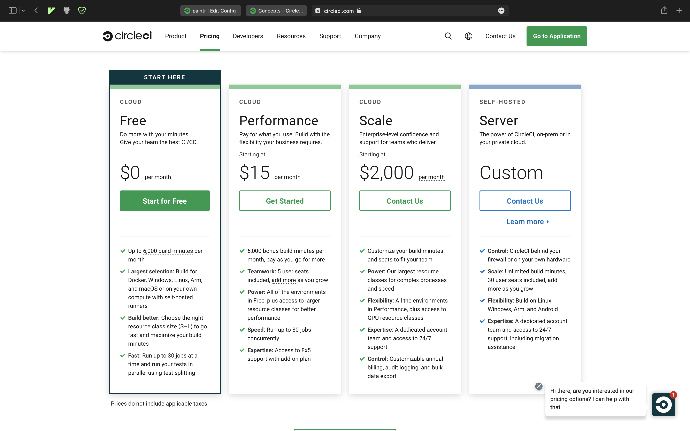

# Servicios de CI/CD

¿Qué es CI/CD?
[Vídeo explicativo](https://www.youtube.com/watch?v=scEDHsr3APg)

---

# GitHub Actions


---

# Workflow

¿Qué es un workflow?


---

- **Workflow** es un proceso automatizado el cual se añade a un repositorio.
- **Job** es un conjunto de **steps** o pasos que se ejecutan en nuestro proceso.
- **Step** es una tarea individual que puede ejecutar comandos dentro de un **job**
- **Action** son los comandos de ejecución del proceso, ejecutados en un **step** para crear un **job**. Son el bloque de construcción más pequeño que hay.

---

# Concurrencia

Los *jobs* se ejecutan de manera paralela a no ser que existan dependencias entre ellos que debemos configurar manualmente.


---

# Ejemplo desde cero
- Vamos a crear una aplicación con **Maven**, como hemos estado haciendo en la asignatura de Mantenimiento.
- Creamos un **repositorio de GitHub** y creamos la carpeta ```.github/workflows/```. 
- Dentro de esa carpeta irá nuestro archivo ```workflow.yml```.

---

Contenido inicial de ```workflow.yml```:

<!--
_color: white
_backgroundColor: #222
_class: []
-->

```yml
name: Build and test of Java Project
 
on: [push]
 
jobs:
 build:
   runs-on: ubuntu-latest
 
   steps:
     - uses: actions/checkout@v2
     - name: Set up JDK 1.8
       uses: actions/setup-java@v1
       with:
         java-version: 1.8
     - name: Build with Maven
       run: mvn -B package --file pom.xml
```

---

# Entendiendo por partes el fichero:

<!--
_color: white
_backgroundColor: #222
_class: []
-->

```yml
name: Build and test of Java Project
 
on: [push]
 
jobs:
 build:
   runs-on: ubuntu-latest
```


- ```name: Build and test of Java Project```: Nombre opcional que le das al fichero, para saber qué hemos hecho.
- ```on: [push]```: ¿Cuándo se va a ejecutar la action? Cuando hagamos push. 
- ```jobs```: Sección donde se pueden especificar todos los jobs que se van a ejecutar.
- ```build```: Único job de este ejemplo, este nombre **sí** es obligatorio.
- ```runs on: ubuntu-latest```: Configura el workflow para que se ejecute en la última versión de ubuntu. Ejecutable también en windows, mac, ...

---

<!--
_color: white
_backgroundColor: #222
_class: []
-->

```yml
   steps:
     - uses: actions/checkout@v2
     - name: Set up JDK 1.8
       uses: actions/setup-java@v1
       with:
         java-version: 1.8
     - name: Build with Maven
       run: mvn -B package --file pom.xml
```

- ```steps```: Sección donde se especifican los pasos del job.
- ```uses: actions/checkout@v2```: La palabra clave *uses* le dice al job de obtener la versión **v2** de la acción **actions/checkout**, son de dominio público en GitHub y hay millones de acciones ya hechas. Esta action comprueba nuestro repositorio y lo descarga en nuestra instancia, permitiendo que sobre el código podamos ejecutar más actions.
- ```Name: Set up JDK.18```: Nombre opcional que se le ha dado a la acción.

---

<!--
_color: white
_backgroundColor: #222
_class: []
-->

```yml
   steps:
     - uses: actions/checkout@v2
     - name: Set up JDK 1.8
       uses: actions/setup-java@v1
       with:
         java-version: 1.8
     - name: Build with Maven
       run: mvn -B package --file pom.xml
```

- ```uses: actions/setup-java@v1```: Esta action se encarga de descargar e instalar una versión de java, en este caso podemos ver la línea *with: java-version: 1.8*, es la versión 1.8.
- ```run: mvn -B package --file pom.xml```: La palabra **run** le dice al job de ejecutar un comando en el runner, en este caso en la línea de comandos de ubuntu. En este caso, estamos utilizando **maven** para compilar y empaquetar nuestro proyecto.

---

# Configuración y ejecución de un workflow

Ahora, una vez creado el workflow, hacemos **push** a nuestro repo en GitHub, justo después podremos verlo en la sección de **Actions** en la página principal del proyecto:


Como podemos observar, ya ha sido creado automáticamente. El icono en amarillo indica que aún está trabajando y no ha sido completado.

---

Además, podemos consultar logs de cada uno de los jobs pulsando sobre ellos:


---

# Automatizar tests

Aplicándolo a lo ya trabajado en la asignatura, si además hemos añadido tests, éstos se ejecutarán y mostrarán los resultados también:


Si alguno de los tests falla, el workflow aparecerá con un aspa roja al lado indicando que algo ha ido mal, una vez arreglado se volverá a ejecutar y si todo va bien aparecerá un tick verde que indicará que todo ha funcionado con éxito.

---

# Construir imagen con Docker

Github Actions nos da la posibilidad de correr nuestro entorno en una imagen Docker, con todas las ventajas que ello tiene. Para ello vamos a añadir el siguiente fichero **dockerfile** a la raíz del proyecto:

<!--
_color: white
_backgroundColor: #222
_class: []
-->

```yml
FROM maven:3.6.0-jdk-8-slim AS build
COPY src /usr/src/app/src
COPY pom.xml /usr/src//app
RUN mvn -B package --file /usr/src/app/pom.xml

FROM java:8
EXPOSE 8080
COPY --from=build /usr/src/app/target/project-test-github-1.0-SNAPSHOT.jar /usr/app/project-test-github-1.0-SNAPSHOT.jar
ENTRYPOINT ["java","-jar","/usr/app/project-test-github-1.0-SNAPSHOT.jar"]
```

---

Una vez añadido el fichero, tenemos que modificar nuestro ```workflow.yml```para indicar que queremos utilizar Docker a través de un Dockerfile, quedando así:

<!--
_color: white
_backgroundColor: #222
_class: []
-->

```yml
name: Build and test of Java Project

on: [push]

jobs:
  build:
    name: Build with Docker
    runs-on: ubuntu-latest

    steps:
      - uses: actions/checkout@v2
      - name: Building the image from the Dockerfile
        uses: ./.github/action-docker
```
---

# ¿Qué ha ocurrido?

Como podemos ver, archivo ```workflow.yml``` ha quedado más pequeño, ya que ahora aparte de la acción del *checkout* simplemente añadimos otra nueva acción que hace referencia a una nueva carpeta que hemos creado llamada ```action-docker```, en esta carpeta añadimos otro ```.yml```con el action que especifica que queremos hacer uso del **dockerfile**:


Es muy importante saber que este archivo dentro de la carpeta ```action-docker``` se tiene que llamar ```action.yml``` si no, **no funcionará**, y este es su contenido:

---

<!--
_color: white
_backgroundColor: #222
_class: []
-->

```yml
name: "Using Docker"
runs:
  using: "docker"
  image: "../../Dockerfile"
```

- Indicamos en *image* donde tenemos nuestro **dockerfile**, ya que lo utilizará para crear la imagen. 
- Si ahora hacemos push de todo esto (*y no nos hemos equivocado ;)*) en los logs del workflow podremos ver como compila:


---

# Secretos

- Los secretos de GitHub actions nos permiten almacenar información sensible en nuestro repositorio para luego poder usarlo en nuestros **workflows**.
- Son **variables de entorno** encriptadas por GitHub, haciendo uso de *libsodium sealed box*
- *Libsodium sealed box* son *"cajas selladas"* que están diseñadas para enviar mensajes a destinatarios dada su clave pública. Sólo el destinatario puede desencriptar el mensaje usando su clave privada.

---

# Añadiendo un secreto en GitHub Actions

 

Una vez pulsado el botón **New Secret** nos encontraremos lo siguiente:


Rellenamos los campos y será accesible desde todos nuestros pipelines.

---

# Minutos y almacenamiento incluidos

Para repositorios privados, cada cuenta de GitHub recibe una cantidad determinada de minutos y almacenamiento gratuito, dependiendo del producto usado:

| Producto                         | Almacenamiento    | Minutos (por mes) |
| -----------                      | -----------       | --------          | 
| GitHub Free                      | 500 MB            | 2.000             | 
| GitHub Pro                       | 1 GB              | 3.000             |
| GitHub Free para organizaciones  | 500 MB            | 2.000             | 
| GitHub Team                      | 2 GB              | 3.000             | 
| Nube de GitHub Enterprise        | 50 GB             | 50.000            | 

---

# Multiplicadores por minuto

Los jobs que se ejecutan en Windows y macOS y que se hospedan en GitHub consumen minutos en una proporción de 2 a 10 veces mayor que aquellos que se ejecutan en Linux. Por ejemplo, utilizar 1,000 minutos en Windows consumirá 2,000 de los minutos incluidos en tu cuenta. Utilizar 1,000 minutos en macOS consumiría 10,000 de los minutos incluidos en tu cuenta.

| Sistema operativo | Multiplicador de minutos
| -----------       | ----------- 
| Linux             | 1
| macOS             | 10
| Windows           | 2

---


# Tasas por minuto

Si tu uso de cuenta sobrepasa estos límites y habías configurado un límite de gastos mayor a $0 USD, pagarás $0.25 USD por GB de almacenamiento por mes y por minuto de uso dependiendo en el sistema operativo que utilice el ejecutor hospedado en GitHub. GitHub redondea hacia arriba los minutos que utiliza cada job.

| Sistema operativo | Tasa por minuto (USD)
| -----------       | ----------- 
| Linux             | $0.008
| macOS             | $0.08
| Windows           | $0.016

---

# Ejemplo de cálculos de costo por minuto

Por ejemplo, si tu organización utiliza GitHub Team y permite gastos ilimitados, utilizar 5,000 minutos podría tener un costo extra de almacenamiento y minutos de $56 USD dependiendo de los sistemas operativos que se utilizan para ejecutar jobs:

- 5,000 minutos (3,000 de Linux y 2,000 de Windows) = $56 USD ($24 USD + $32 USD).
  - 3,000 minutos de Linux a $0.008 USD por minuto = $24 USD.
  - 2,000 minutos de Windows a $0.016 USD por minuto = $32 USD.

--- 

# Ventajas

- Las acciones de GitHub son solo ejecuciones consecutivas de Docker. Muy fácil razonar y depurar. Fácil de reproducir el entorno de compilación.
- Hay infinidad de implementaciones de acciones en GitHub, por lo que muy rara vez habrá que crear una acción desde cero.
- Secretos.

---

# Inconvenientes
- No tienen almacenamiento en caché de manera nativa.
- Documentación escasa.
- Hay algunas actions en GitHub de calidad dudosa.
- No es la mejor manera de ejecutar tests unitarios.

---

# Circle CI


_Plataformas exóticas_

---

<!--
Cuando inicias sesión o te registras utilizando GiHub o BitBucket, esta es la
pestaña principal que se presenta. Puedes ver todos los repositorios de la
organización y gestionar sus runners
-->


---


- **Fastest**: Utiliza un fichero ya existente en el repo
- **Faster**: Crea una rama `circleci-project-setup` con un fichero
  `.circleci/config.yml`
- **Fast**: Te permite configurar el fichero `.circleci/config.yml` de forma
  similar a GitHub Actions

---


---


---


---

## `config.yml`

Fichero YAML ubicado en la carpeta `.circleci` en cualquier rama del
repositorio. Podemos editarlo manualmente desde nuestro editor de código
favorito o desde la web

---


---

<!--
_color: white
_backgroundColor: #222
_class: []
-->

### Estructura

```yaml
version: 2.1
# Orbs requeridos
orbs:
  node: circleci/node@4.7.0
jobs:
  build:
    # Entorno de ejecución (`docker`, `machine`, `macos` or `executor`)
    executor:
      name: node/default
      tag: "10.4"
    # Etapas que componen el trabajo
    steps:
      - checkout
      - node/with-cache:
          steps:
            - run: npm install
      - run: npm run test
```

---

# Workflows

- Conjunto de jobs a ejecutar en **paralelo**
- Se pueden definir dependencias entre trabajos (esperar que acabe la etapa de
  `build` para iniciar los test)

---

<!--
_color: white
_backgroundColor: #222
_class: []
-->

```yml
version: 2.1
jobs:
  hello-world:
    docker:
      - image: cimg/node:17.2.0 # the primary container, where your job's commands are run
    steps:
      - checkout # check out the code in the project directory
      - run: echo "hello world" # run the `echo` command
workflows:
  hello:
    - hello-world
```

---

# Orbs

- Utilidades por la comunidad o por Circle CI
- Funcionan como **módulos**
- Se importan y se exportan
- Simplifican enormemente el desarrollo de workflows multiplataforma

---

<!--
_color: white
_backgroundColor: #222
_class: []
_footer: 'Fuente: https://circleci.com/developer/orbs/orb/circleci/rust#commands-build'
-->

```yaml
version: "2.1"
orbs:
  # Orb de Rust (aka. `from circleci import rust@x.y.z as rust `)
  rust: circleci/rust@x.y.z
workflows:
  # Definimos los distintos workflows disponibles (aka. `production.py`)
  production:
    jobs:
      # Ejecutamos la función `build` dentro del orb definido
      # anteriormente (aka. `rust.build(release=True)`)
      - rust/build:
          release: true
```

---

# Jobs

- Funciones a llamar para ser ejecutadas
- Cada job puede ser en un entorno distinto
- Pueden definirse globalmente para todos los workflows o para un workflow
  concreto

---

<!--
_color: white
_backgroundColor: #222
_class: []
-->

```yaml
version: 2
jobs: # we now have TWO jobs, so that a workflow can coordinate them!
  # aka. `def hello-world():`
  hello-world: # This is our first job.
    docker: # it uses the docker executor
      - image: cimg/ruby:2.6.8 # specifically, a docker image with ruby 2.6.8
        auth:
          username: mydockerhub-user
          password: $DOCKERHUB_PASSWORD # context / project UI env-var reference
    # Steps are a list of commands to run inside the docker container above.
    steps:
      - checkout # this pulls code down from GitHub
      # aka. `hello-world()`
      - run: echo "A first hello" # This prints "A first hello" to stdout.
workflows:
  version: 2
  one_and_two: # this is the name of our workflow
    jobs: # and here we list the jobs we are going to run.
      - hello-world
```

---

# Demo

Link: [Altair-Bueno/paintr](https://github.com/Altair-Bueno/paintr)

---

<!--
_color: white
_backgroundColor: #222
_class: []
-->

```yml
version: 2.1
executors:
  rust-executor:
    docker:
      - image: cimg/rust:1.60.0
jobs:
  test-kahlo:
    executor: rust-executor
    steps:
      - checkout
      - restore_cache:
          key: kahlo-rust-cache-{{ checksum "kahlo/Cargo.lock" }}
      - run: |
          cd ./kahlo
          cargo test
      - save_cache:
          key: kahlo-rust-cache-{{ checksum "kahlo/Cargo.lock" }}
          paths:
            - "~/.cargo"
            - "./kahlo/target"
orbs:
  node: circleci/node@5.0.2
workflows:
  test:
    jobs:
      - test-kahlo
      - node/run:
          app-dir: "./dali"
          npm-run: "test"
```

---

# Planes y precios

<!--
_footer: Fuente: https://circleci.com/pricing/
-->

---



---

|             | Hardware\*  | Creditos | Usuarios    | Precio     | Público objetivo           |
| ----------- | ----------- | -------- | ----------- | ---------- | -------------------------- |
| Free \*\*   | VMs         | 30.000   | 1           | Gratis     | Desarrolladores            |
| Performance | VMs + macOS | 55.000   | 5 gratuitos | Desde \$15 | Pequeñas empresas          |
| Scale       | Todo        | Custom   | Custom      | \$2.000    | Pequeñas/medianas empresas |
| Server      | Todo        | Custom   | Custom      | Custom     | Grandes empresas           |

> \* Docker, VMs (linux, windows, macOS, ARM linux), baremetal macOS, NVIDIA GPU
> cluster (versiones linux y windows)
>
> \*\* Proyectos OSS tienen más créditos

---

# Créditos

### Moneda digital de Circle CI utilizado para pagar, en tiempo real, por los servicios utilizados

---

## Servicios que consumen creditos

- Cada runner tiene un precio de **créditos/minuto** (warm-up time no cuenta)
- **Número de usuarios activos/mes**
- **Red y almacenamiento**: Direcciones IP, paquetes de red y almacenamiento que
  excedan la cuota
- **Miscelanea**: Las funciones extra también se pagan mediante créditos

## Importante!!

- Los créditos que pertenecen a tu plan que no gastes desaparecerán al mes
  siguiente
- Si tus créditos bajan del 2%, Circle CI automáticamente renovará un 25% de
  ellos
- Si cancelas tu cuenta, no recuperas el dinero. D:

---

# Puntos fuertes

- Permite configurar runners concurrentes de forma sencilla
- Amplio abanico de ofertas hardware. Especialmente interesante el soporte para
  **gráficas NVIDIA** tanto en windows como linux
- Soporte de primer grado para contenedores de **Docker**
- El plan gratuito no requiere tarjeta de crédito
- Acceso a los workflows mediante ssh tras su finalización
- Todos los jobs se ejecutan en paralelo
- Los jobs no se ejecutan si los ficheros no se han cambiado

---

# TravisCI


---


---


---


---

# Jobs

---

## Install
- Instala las dependencias necesarias

## Script
- Ejecuta el script/comando que se le proporcione

## Otros
- `before_install`
- `before_script`
- `after_script`
- `after_success`
- `after_failure`

---
<!--
_color: white
_backgroundColor: #222
_class: []
-->

## Matrix
```yml
language: ruby
rvm:
- 1.9.3
- 2.0.0
- 2.1.0
env:
- DB=mongodb
- DB=redis
- DB=mysql
gemfile:
- Gemfile
- gemfiles/rails4.gemfile
- gemfiles/rails31.gemfile
- gemfiles/rails32.gemfile
jobs:
  exclude:
  - rvm: 2.0.0
    gemfile: Gemfile
```

---

<!--
_color: white
_backgroundColor: #222
_class: []
-->
## Stages
```yml
jobs:
  include:
    - stage: "Tests"                
      name: "Unit Tests"            
      script: ./unit-tests
    - script: ./integration-tests
      name: "Integration Tests"   

    - stage: deploy
      name: "Deploy"
      script: ./deploy
```

---

<!--
_color: white
_backgroundColor: #222
_class: []
-->
## Conditional Jobs
```yml
jobs:
  include:
      if: branch = master
      env: FOO=baz
```

---

# Demo
[CTMarin/acnhpedia-back](https://github.com/CTMarin/acnhpedia-back)

---

## .travis.yml
<!--
_color: white
_backgroundColor: #222
_class: []
-->
```yml
language: rust
cache: cargo
rust:
  - stable
  - beta
  - nightly
jobs:
  include:
    - stage: "Tests"
      script: cargo test
      allow_failures:
        - rust: nightly
      fast_finish: true

    - stage: "Deploy"
      deploy:
        on:
          branch: master
        provider: cargo
        token: $CRATES_TOKEN
```
---

# Planes y precios

---

## Concurrency Plan


---

## Usage-based Plan

<div style="display: flex; justify-content: space-around">

| Mensual | Creditos | Precio |
| ------- | -------- | ------ |
|         | 50K      | $30    |
|         | 100K     | $60    |
|         | 200K     | $120   |
|         | 300K     | $180   |
|         | 400K     | $240   |
|         | 500K     | $300   |

| Anual | Creditos | Precio |
| ----- | -------- | ------ |
|       | 600K     | $330   |
|       | 1200K    | $660   |
|       | 2400K    | $1320  |
|       | 3600K    | $1980  |
|       | 4800K    | $2640  |
|       | 6000K    | $3300  |

</div>

---

# Puntos fuertes
* Sintaxis sencilla y fácil de interpretar
* Muy buena documentación
* Flexibilidad en planes de precios

# Puntos débiles
* Versión gratuíta necesita tarjeta
* Versión gratuíta dura 1 mes

---

# GitLab Runners


---


---

# Runners

---


---


### Proporciona templates en diversos lenguajes para generar el pipeline, como Django, LaTeX, Rust, Nodejs, Python, Scala...

---


---


---

<!--
_color: white
_backgroundColor: #222
_class: []
-->

```yaml
stages:          
  - build
  - test
  - deploy
```

# Stages

- Listas de jobs a realizar y su orden
- A continuación se define cada stage

---

<!--
_color: white
_backgroundColor: #222
_class: []
-->

```yaml
build-job:
  stage: build
  script:
    - echo "Compiling..."
    - mvn compile
    - echo "Compile complete."

unit-test-job:
  stage: test
  script:
    - echo "Running unit tests..."
    - mvn test
    - echo "Tests verified"

deploy-job:
  stage: deploy
  script:
    - echo "Deploying application..."
    - mvn deploy
    - echo "Application successfully deployed."
```

---

## Cada bloque job descrito en el fichero `.yml` contiene

- Título `<phase>-job`
- Stage al que pertenece `stage`
- Orden de los comandos a realizar `script`

---

<!--
_color: white
_backgroundColor: #222
_class: []
-->

```yaml
unit-test-job:
  stage: test
  script:
    - echo "Running unit tests..."
    - mvn test
    - echo "Tests verified"
```

---

# Runner funcionando


---

# Runner generado


---

# Planes y precios

---


---

|                                    | Free | Premium | Ultimate | 
| ---------------------------------- | ---- | ------- | -------- | 
| Minutos de CI/CD por mes           | 400 | 10.000   | 50.000   | 
| Open Source / Licencia MIT         | X   | X        | X        |
| Método Ágil incluido               |     | X        | X        |
| Testing de Seguridad Avanzado      |     |          | X        | 
| Mitigación de riesgos de Seguridad |     |          | X        | 

- +$10 por 1.000 **minutos de CI/CD** extra
- +$60 por 10GB de **almacenamiento** y 20GB de **transferencia** extra

---

# Puntos fuertes

- Viene integrado en GitLab
- Compatibilidad entre versiones distintas de GitLab
- Monitorización de runners mediante Prometheus
- Permite limitar el número de jobs concurrentes por token

---

# Conclusión

---

## Conclusión

<!--
  Añade las conclusiones respecto a tu runner. Estas diapositivas van
  AL FINAL DE LA PRESENTACIÓN
-->

- **GitHub Actions**: La mejor manera de comenzar a trabajar con CI/CD.
- **Circle CI**: Desarrollo multiplataforma, GPU computing o con alta
  dependencia en Dockers
- **Travis CI**: Rapidez para escribir los workflows