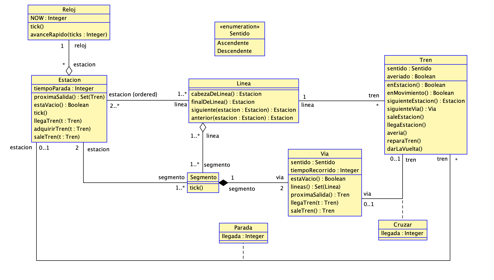

---
title: P2
author:
  - "Francisco Javier Hernandez Martín"
  - "Jose Luis Bueno Pachón"
  - "Carlos Marín Corbera"
  - "Carmen Gonzalez Ortega"
  - "Altair Bueno Calvente"
date: 26 nov 2021
keywords:
  - Modelado
  - P2
  - USE
  - SOIL
  - Papyrus
  - MagicDraw
  - Metro
titlepage: true
titlepage-rule-color: "396EB0"
logo: ./resources/uma.png
toc-own-page: true
toc: true
# toc-depth: 3
fontfamily: helvet
...

# Introducción

En esta tarea, hemos modelado el sistema de un metro que transportará pasajeros de una estación a otra en USE y SOIL. Para ello, esta vez hemos añadido las máquinas de estado y operaciones necesarias para un modelado lo más parecido a la realidad posible, además de las clases, relaciones y restricciones necesarias.

# Modelo

# Clases y Atributos

- ## Enumeración Sentido
La enumeración **Sentido** representa los dos sentidos -Ascendente y Descendente- en los que un tren puede recorrer la línea en la que se esté desplazando.

- ## Clase Reloj
La clase **Reloj** representa el tiempo en nuestro modelo. Tiene un atributo Integer *NOW* que nos indica el tiempo actual del sistema.

- ## Clase Estacion
La clase **Estacion** representa las estaciones donde pararán los trenes para soltar y a recoger pasajeros. Tiene un atributo Integer *tiempoParada* que representa el tiempo que tiene que esperar un tren estacionado en una estacion.

- ## Clase Linea
La clase **Linea** representa la linea del metro. Esto es, el recorrido que se le asigna a un tren y que tiene que seguir. 

- ## Clase Segmento
La clase **Segmento** representa un segmento de una línea. Esto es, el tramo de vías que hay entre dos estaciones.

- ## Clase Vía
La clase **Vía** representa el medio físico por el que viajan los trenes y por el que están compuestos los segmentos. Un tren avanza por una de las vías de un segmento. Tiene un atributo *sentido* que es del tipo del enum *Sentido* definido previamente, y que sirve para representar el sentido en el que avanzaran los trenes al desplazarse por dicha via; y otro atributo Integer *tiempoRecorrido*, que representa el tiempo que tarda un tren en recorrer dicha vía.

- ## Clase Tren
La clase **Tren** representa el vehículo que avanza por las líneas del metro transportando a los pasajeros. Esta tiene un atributo *sentido* del tipo del enum *Sentido*, y un atributo Booleano *averiado* que representa si el tren está averiado o no.

# Relaciones

- ## Agregación Estación-Reloj "Tiempo"
Sirve para acceder al Reloj, y por ende al tiempo, desde cualquier clase (a través de la clase Estación). Las multiplicidades de la relación son un reloj y muchas estaciones, puesto que en cada estación hay exactamente un reloj, y un reloj puede estar en ninguna, una o varias estaciones.

- ## Asociación Línea-Estación "Estaciones"
Sirve para representar que una línea queda definida por una secuencia ordenada de estaciones por las que pasarán los trenes. Las multiplicidades de la relación son de una a muchas líneas, y de dos a muchas estaciones; puesto que una estación tiene que permanecer a al menos una línea, y una línea está formada de al menos dos estaciones (ya que un segmento necesita dos estaciones -origen y destino-, y una línea tiene al menos un segmento).