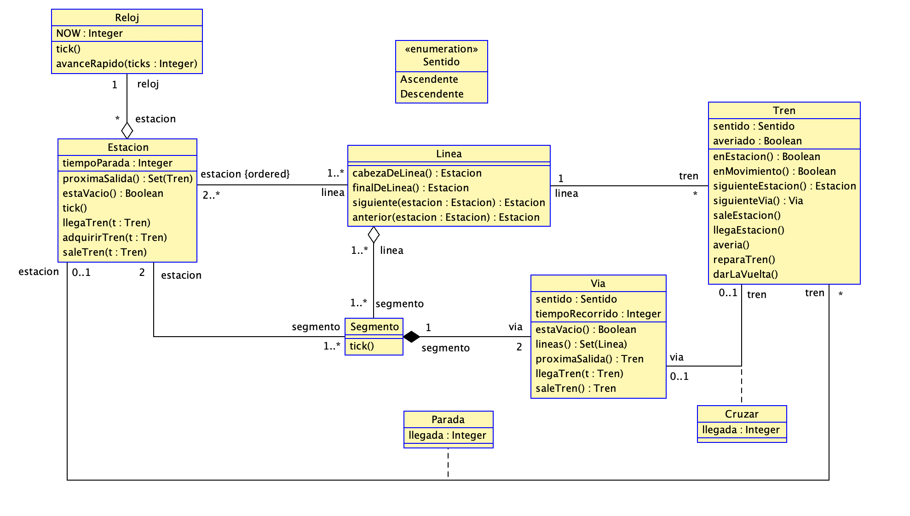
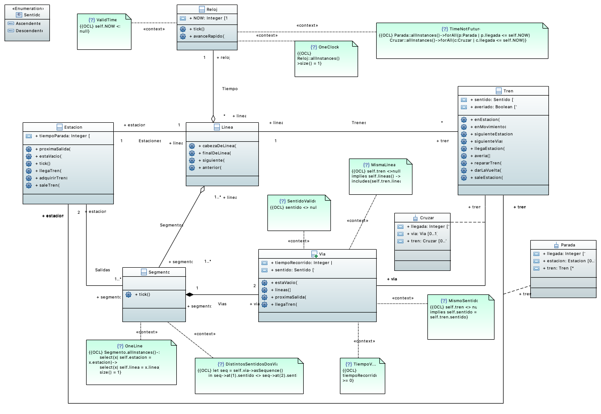
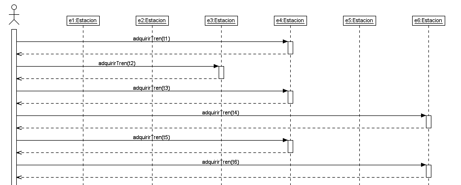
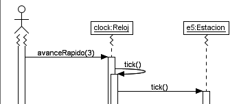
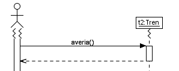
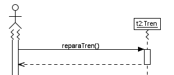
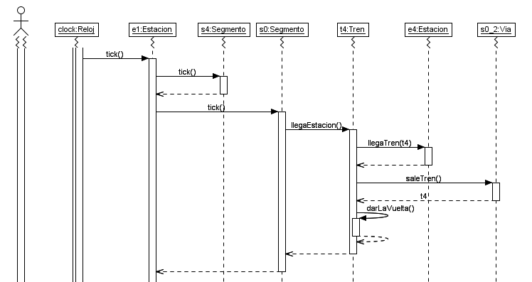

---
title: P2
author:
  - "Francisco Javier Hernandez Martín"
  - "Jose Luis Bueno Pachón"
  - "Carlos Marín Corbera"
  - "Carmen Gonzalez Ortega"
  - "Altair Bueno Calvente"
date: 26 nov 2021
keywords:
  - Modelado
  - P2
  - USE
  - SOIL
  - Papyrus
  - MagicDraw
  - Metro
titlepage: true
titlepage-rule-color: "396EB0"
logo: ./resources/uma.png
toc-own-page: true
toc: true
# toc-depth: 3
fontfamily: helvet
...

# 1. Introducción

En esta tarea, hemos modelado el sistema de un metro que transportará pasajeros de una estación a otra en USE y SOIL. Para ello, esta vez hemos añadido las máquinas de estado y operaciones necesarias para un modelado lo más parecido a la realidad posible, además de las clases, relaciones y restricciones necesarias.

# 2. Modelo



# 3. Clases y Atributos

## Enumeración Sentido
La enumeración **Sentido** representa los dos sentidos -Ascendente y Descendente- en los que un tren puede recorrer la línea en la que se esté desplazando.

## Clase Reloj
La clase **Reloj** representa el tiempo en nuestro modelo. Tiene un atributo Integer *NOW* que nos indica el tiempo actual del sistema.

## Clase Estacion
La clase **Estacion** representa las estaciones donde pararán los trenes para soltar y a recoger pasajeros. Tiene un atributo Integer *tiempoParada* que representa el tiempo que tiene que esperar un tren estacionado en una estacion.

## Clase Linea
La clase **Linea** representa la linea del metro. Esto es, el recorrido que se le asigna a un tren y que tiene que seguir. 

## Clase Segmento
La clase **Segmento** representa un segmento de una línea. Esto es, el tramo de vías que hay entre dos estaciones.

## Clase Vía
La clase **Vía** representa el medio físico por el que viajan los trenes y por el que están compuestos los segmentos. Un tren avanza por una de las vías de un segmento. Tiene un atributo *sentido* que es del tipo del enum *Sentido* definido previamente, y que sirve para representar el sentido en el que avanzaran los trenes al desplazarse por dicha via; y otro atributo Integer *tiempoRecorrido*, que representa el tiempo que tarda un tren en recorrer dicha vía.

## Clase Tren
La clase **Tren** representa el vehículo que avanza por las líneas del metro transportando a los pasajeros. Esta tiene un atributo *sentido* del tipo del enum *Sentido*, y un atributo Booleano *averiado* que representa si el tren está averiado o no.

# 4. Relaciones

## Agregación Estacion-Reloj "Tiempo"
Sirve para acceder al Reloj, y por ende al tiempo, desde cualquier clase (a través de la clase Estación). Las multiplicidades de la relación son un reloj y muchas estaciones, puesto que en cada estación hay exactamente un reloj, y un reloj puede estar en ninguna, una o varias estaciones.

## Asociación Linea-Estacion "Estaciones"
Sirve para representar que una línea queda definida por una secuencia ordenada de estaciones por las que pasarán los trenes. Las multiplicidades de la relación son de una a muchas líneas, y de dos a muchas estaciones; puesto que una estación tiene que permanecer a al menos una línea, y una línea está formada de al menos dos estaciones (ya que un segmento necesita dos estaciones -origen y destino-, y una línea tiene al menos un segmento). Para ello, además, las estaciones se almacenarán en un conjunto ordenado (por orden de inserción) especificandolo en USE con la palabra reservada *ordered* en el campo de la clase Estacion de la asociación.

## Agregación Linea-Segmento "Segmentos"
Usada para modelar el hecho de que una línea está formada por segmentos, como hemos comentado previamente. Las multiplicidades son de una a muchas lineas, y de uno a muchos segmentos; puesto que un segmento pertenece a al menos una línea (aunque puede pertenecer a varias), y una linea tiene al menos un segmento.

## Asociación Segmento-Estacion "Salidas"
Representa que un segmento está definido por el medio físico entre dos estaciones en el que viaja el tren. Para ello, las multiplicidades son exactamente dos estaciones, y uno o más segmentos puesto que las estaciones pueden pertenecer a varios segmentos.

## Clase Asociación Estacion-Tren "Parada"
Representa la acción de que un tren estacione en una estación. La clase asociación tiene un atributo Integer *llegada* que representa el tiempo exacto en el que el tren llegó a la estación. Las multiplicidades son cero o una estación y muchos trenes. Esto es así ya que un tren puede estar o no en una estación, y una estación puede tener estacionados a ninguno o varios trenes.

## Clase Asociación Via-Tren "Cruzar"
Representa la acción de que un tren esté en movimiento en una de las vías de un segmento. La clase asociación tiene un atributo Integer *llegada* que representa el tiempo exacto en el que el tren comenzó a desplazarse por la vía. Las multiplicidades son cero o una vía y cero o un tren. Esto es así ya que un tren puede estar o no en una vía, y una vía puede tener a lo sumo un tren desplazándose por ella.

## Composición Segmento-Via "Vias"
Representa el hecho de que un segmento está compuesto por dos vías, una que se recorre en un sentido y la otra en el sentido contrario. Las multiplicidades por tanto son exactamente un segmento y exactamente dos vías.

## Asociación Tren-Linea "Trenes"
Usada para modelar el hecho de que en una línea se tienen trenes circulando en el recorrido designado para ella. Las multiplicidades son muchos trenes y exactamente una línea, puesto que una línea puede tener a ninguno o varios trenes circulando por ella, y un tren solo puede estar circulando en una línea (en un momento concreto, luego podrá cambiar de línea si así se decide).

# 5. Restricciones Invariantes
## Context Reloj
- **OneClock:** Solamente puede haber una instancia de reloj en el sistema en todo momento.
- **ValidTime:** El tiempo actual no puede ser nulo.
- **TimeNotFuture:** Todos los atributos de tiempo en el sistema tienen que tener un valor menor o igual al tiempo actual. Es decir, no puede haber marcas de tiempo guardadas futuras.
## Context Segmento
- **OneLine:** Si dos estaciones están conectadas por varios segmentos, estos han de pertenecer a líneas distintas.
- **DistintosSentidosVias:** Los sentidos de las dos vías de un segmento tienen que ser opuestos entre sí.
## Context Via
- **sentidoValido:** El atributo sentido no puede ser null.
- **tiempoValido:** El tiempo del recorrido tiene que ser un número positivo.
- **mismoSentido:** El sentido asignado a un tren tiene que ser el mismo que el sentido asignado a la vía por la que se desplaza.
- **mismaLinea:** La línea a la que pertenece la vía es la misma a la que pertenece el tren que se está desplazando por ella.

## Context Parada
- **llegadaAEstacionValida:** El tiempo de llegada a una estación no puede ser nulo.
## Context Cruzar
- **llegadaAViaValida:** El tiempo de llegada a una vía no puede ser nulo.

# 6. Operaciones y Queries
## Clase Reloj
- **tick()** = Avanza el reloj en una unidad de tiempo y propaga el avance a las estaciones.
- **avanceRapido(ticks:Integer)** = Avanza el reloj tantas unidades de tiempo como se pase por parámetro a la operación en *ticks*.

## Clase Linea
- **cabezaDeLinea():Estacion** = Query que devuelve la primera estación de una línea.
- **finalDeLinea():Estacion** = Query que devuelve la última estación de una línea. 
- **siguiente(estacion:Estacion):Estacion** = Query que devuelve la estación siguiente, en el orden establecido, a la estacion *estacion* pasada como parámetro.
- **anterior(estacion:Estacion):Estacion** = Query que devuelve la estación anterior, en el orden establecido, a la estacion *estacion* pasada como parámetro.

## Clase Segmento
- **tick()** = Para todos los trenes que estén a punto de abandonar la vía en la que estén circulando, se completa la salida. (Más detalles en la operación *llegaEstacion()* de la clase Tren).

## Clase Estación
- **proximaSalida():Set(Tren)** = Query que devuelve un conjunto con los trenes que saldrán de la estación en la próxima iteración de tiempo.
- **estaVacio():Boolean** = Query que devuelve true si no hay ningún true estacionado en la estación y false en caso contrario.
- **cantidadTrenes():Integer** = Query que devuelve el número de trenes que hay en la estación.
- **tick()** = Propaga el tick de reloj a la clase Segmento y a los trenes que estén estacionados en la estación.
  - **post algunoHabraSalidoSiHabiaTrenesOperativos** = Si habia trenes con salida próxima, en este tick han tenido que salir.
- **llegaTren(t:Tren)** = Estaciona al tren *t*, que llega de desplazarse en una vía, en la estación.
  - **pre noEstaEnEstacion** = El tren no está ya en la estación. 
  - **pre estaEnViaConectadaALaEstacion** = El tren está desplazándose por una vía que está conectada a la estación a la que quiere llegar.
  - **pre puedeSalir** = El tren puede abandonar la vía sobre la que se desplaza.
  - **post estaEnEstacion** = El tren ahora está estacionado en la estación.
- **adquirirTren(t:Tren)** = Estaciona al tren *t* en la estación.
  - **pre mismaLinea** = Un tren tiene que pertenecer a la misma línea que a la que pertenece la estación para que esta pueda adquirirlo.
  - **pre noPerteneceAOtraEstacion** = Un tren no puede estar ya en otra estación si otra quiere adquirirlo.
  - **pre noPerteneceAOtraVia** = Una estación no puede adquirir un tren si éste está desplazándose por una vía.
  - **post perteneceALaEstacion** = El tren adquirido está ahora en la estación.
  - **post alMenosUnTrenEnEstacion** = La estación no puede tener cero trenes estacionados tras esta operación.
- **saleTren(t:Tren)** = Sale el tren *t* de la estación.
  - **pre enEstacion** = Si un tren quiere salir de una estación, éste tiene que estar estacionado en la estación.
  - **pre noRoto** = Un tren averiado no puede salir a una vía.
  - **post noEnEstacion** = El tren que ha salido de la estación ya no está en dicha estación.

## Clase Via
- **estaVacio():Boolean** = Query que devuelve true si la vía está vacía y false en caso contrario.
- **lineas():Set(Linea)** = Query que devuelve un conjunto con las líneas con las que está relacionada la vía.
- **proximaSalida():Tren** = Query que devuelve el próximo tren que saldrá, o null si no hay tren o todavía no ha llegado al final.
- **llegaTren(t:Tren)** = El tren *t* recibido como parámetro llega a la vía y se añade a la relación.
  - **pre libre** = La vía no puede estar ocupada si va a recibir un tren.
  - **pre mismoSentido** = El sentido de la vía tiene que ser el mismo que el del tren.
  - **pre mismaLinea** = La línea en la que está actualmente un tren que llega a una vía tiene que ser una de las líneas que incluye a dicha vía en su recorrido.
  - **pre noAveriado** = Un tren que está averiado no puede desplazarse por una vía.
  - **post ocupada** = La vía ya no se encuentra desocupada.
- **saleTren():Tren** = Se elimina el tren que se encontraba en la vía y se devuelve éste como resultado de la operación.
  - **pre estaOcupado** = Si un tren va a salir de una vía, esta tiene que estar ocupada por ese tren.
  - **pre noTeletransporte** = Para que un tren salga de la vía, tiene que estar listo para salir de ella.
  - **post libre** = La vía queda desocupada.

## Clase Tren
- **enEstacion():Boolean** = Query que devuelve true si el tren se encuentra parado en una estación, y false en caso contrario.
- **enMovimiento():Boolean** = Query que devuelve true si el tren se encuentra desplazándose por una vía, y false en caso contrario.
- **siguienteEstacion():Estacion** = Query que devuelve la siguiente estación a la que se dirige el tren.
- **siguienteVia(): Via** = Query que devuelve la siguiente vía en la que se va a desplazar el tren.
- **saleEstacion()** = Saca al tren de la estación en la que está estacionado, metiéndolo en la siguiente vía.
  - **pre mismoSentido** = La vía a la que va a salir un tren al abandonar la estación tiene que tener el mismo sentido de recorrido asignado que el tren.
  - **pre mismaLinea** = La vía a la que va a salir un tren al abandonar la estación tiene que pertenecer a la misma línea que el tren.
  - **pre viaVacia** = La vía a la que va a salir el tren tiene que estar desocupada.
  - **pre noAveriado** = Un tren que no puede abandonar una estación estando averiado.
  - **pre enEstacion** = Un tren que quiere abandonar una estación, tiene que estar estacionado en dicha estación.
  - **pre estacionCorrespondeLinea** = La vía a la que va a salir un tren al abandonar una estación tiene que estar conectada con dicha estación.
  - **post noEnEstacion** = El tren ya no está en la estación.
  - **post viaOcupada** = La vía sobre la que el tren se desplaza ahora tiene que estar ocupada.
- **llegaEstacion()** = Mete al tren en la siguiente estación que le toca, sacándolo de la vía en la que se desplazaba.
  - **pre enVia** = Un tren que quiere estacionar en una estación, tiene que estar desplazándose por una vía.
  - **pre viaConectaEstacion** = Un tren que quiere estacionar en una estación, tiene que estar desplazándose por una vía que esté conectada a dicha estación.
  - **post enEstacionOcupada** = El tren está ahora en una estación, y esta está ocupada.
- **averia()** = Activa la avería del tren.
  - **pre noEstaAveriado** = Un tren que se avería no estaba averiado previamente.
  - **post estaAveriado** = El tren está averiado ahora.
- **reparaTren()** = Desactiva la avería del tren.
  - **pre estaAveriado** = Un tren que se repara estaba averiado previamente.
  - **post noEstaAveriado** = El tren ya no está averiado.
- **darLaVuelta()** = Cambia el sentido del tren una vez se llega a final del recorrido de la línea.
  - **pre trenEnEstacion** = Un tren que quiera dar la vuelta tendrá que estar estacionado en una estación para hacerlo.
  - **pre enColaDeLinea** = Un tren que quiera dar la vuelta tendrá que estar estacionado en la última estación de la línea para hacerlo.
  - **post cambiaSentido** = El sentido que tiene el tren tras la operación es el contrario al que tenía antes.

# 7. Máquinas de estado

## **1. CLASE RELOJ**
## PSM Reloj

### Estados

- **s** = Estado inicial.
- **tiempo** = El reloj está en funcionamiento.\

### Transiciones

- **s -> tiempo** { create }
- **tiempo -> tiempo** { tick() }

## **2. CLASE ESTACION**
## PSM Estacion

### Estados

- **s** = Estado inicial.
- **vacio** = La estación no tiene ningún tren estacionado.
- **ocupado** = La estación tiene al menos un tren estacionado.

### Transiciones

- **s->vacio** { create }
        
- **vacio->ocupado** { llegaTren() }
- **vacio->ocupado** { adquirirTren() }
        
- **ocupado->vacio** { [self.cantidadTrenes() = 1] saleTren() }
- **ocupado->ocupado** { [self.cantidadTrenes() > 1] saleTren() }
- **ocupado -> ocupado** { llegaTren() }
- **ocupado -> ocupado** { adquirirTren() }

## **3. CLASE VIA**
## PSM Estacion

### Estados

- **s** = Estado inicial.
- **vacio [self.estaVacio()]** = La vía no tiene ningún tren recorriéndola.
- **ocupado [not self.estaVacio()]** = La estación tiene a un tren recorriéndola.

### Transiciones

- **s->vacio** { create }      
- **vacio->ocupado** { llegaTren() }      
- **ocupado->vacio** { saleTren() }
  
## **4. CLASE TREN**
## PSM Movimiento

### Estados

- **s** = Estado inicial.
- **enParada** = El tren esta estacionado en una estación.
- **enTransito [self.enMovimiento()]** = El tren está desplazándose por una vía.

### Transiciones

- **s->enParada** { create }
- **enParada->enTransito** { saleEstacion() }
- **enTransito->enParada** { llegaEstacion() }
- **enParada->enParada** { darLaVuelta() }

## PSM AveriasTren

### Estados

- **s** = Estado inicial.
- **disponible [self.averiado = false]** = El tren no está averiado y está disponible para desplazarse.
- **averiado [self.averiado = true]** = El tren está averiado y no está disponible para desplazarse.

### Transiciones

- **s->disponible** { create }
- **disponible->averiado** { averia() }
- **averiado->disponible** { reparaTren() }


# 8. Bloques de Código
## **Metro.use**

### Descripción
Archivo principal donde se especifica el modelo y todos los componentes descritos anteriormente.
### Código
```ruby
model Metro

enum Sentido {
    Ascendente,
    Descendente
}

class Reloj
attributes
    NOW:Integer init = 0 -- Minutos
operations
    --Propaga tick a estacion.
    tick()  
        begin
            self.NOW:=self.NOW+1;
            for e in Estacion.allInstances do
                e.tick()
            end;
        end
        post: self.NOW@pre + 1 = self.NOW
    avanceRapido(ticks:Integer)
        begin
            for a in Sequence {1..ticks} do
                self.tick();
            end;
        end
        pre: ticks > 0
        post: self.NOW@pre + ticks = self.NOW
constraints
    inv OneClock:
        Reloj.allInstances()->size() = 1
    inv ValidTime:
        NOW <> null
    -- Todas las fechas tienen que ser pasadas, no podemos tener fechas en el futuro
    inv TimeNotFuture:
        Parada.allInstances()->forAll(p | p.llegada <= self.NOW) and
        Cruzar.allInstances()->forAll(c | c.llegada <= self.NOW)
statemachines
    psm Reloj
        states
            s:initial
            tiempo [self.NOW <> null]
        transitions
            s->tiempo {create}
            tiempo->tiempo {tick()}
    end
end

class Linea
operations
    cabezaDeLinea():Estacion = self.estacion->first()
    finalDeLinea():Estacion = self.estacion->last()
     -- Siguiente en el orden ascendente normal
    siguiente(estacion:Estacion):Estacion = 
        let index = self.estacion->indexOf(estacion)
        in self.estacion->at(index + 1)
    -- Anterior en el orden ascendente normal
    anterior(estacion:Estacion):Estacion = 
        let index = self.estacion->indexOf(estacion)
        in self.estacion->at(index - 1)

end

class Segmento
operations
    tick()
        begin
            for v in self.via->select(v | v.proximaSalida() <> null) do
                v.proximaSalida().llegaEstacion();
            end;
        end
constraints
    inv OneLine:
        -- Todos los segmentos
        Segmento.allInstances()-> 
        -- Los segmentos conectan las mismas dos estaciones
        select(x| self.estacion = x.estacion)->
        -- Los segmentos tienen la mismas líneas
        select(x| self.linea = x.linea)->
        -- Solo puede haber un segmento
        size() = 1
    -- Las vías de un segmento tienen que ser de sentidos contrarios
    inv DistintosSentidosVias:
        let seq = self.via->asSequence()
        in seq->at(1).sentido <> seq->at(2).sentido
end

class Estacion
attributes
    tiempoParada:Integer init = 1 -- 1 minuto de parada
operations
    proximaSalida():Set(Tren) = 
        self.tren->
        select(t | (self.reloj.NOW - t.parada.llegada >= tiempoParada))->
        select(t | not t.averiado)->
        select(t | t.siguienteVia().estaVacio())                        
    estaVacio():Boolean = self.tren->isEmpty()
    --Devuelve el numero de trenes que hay en la estacion
    cantidadTrenes(): Integer = self.tren->size()
    --Propaga un tick de tiempo a los segmentos y trenes parados
    tick() 
        begin
            --Propaga un tick de reloj a los segmentos para que ellos los propaguen a los trenes que se encuentran en ellos.
            for s in self.segmento do 
                s.tick();
            end;
            --Para cada tren que puede salir:
            for t in self.tren do 
                if self.proximaSalida() -> includes(t)
                then 
                    t.saleEstacion();
                end;
            end;
        end
        post algunoHabraSalidoSiHabiaTrenesOperativos: (self@pre.proximaSalida()->notEmpty()) implies (self.proximaSalida() <> self@pre.proximaSalida())
    llegaTren(t:Tren)
        begin
            insert(self,t) into Parada;
        end
        pre noEstaEnEstacion: t.enMovimiento()
        pre estaEnViaConectadaALaEstacion: self.segmento.via->includes(t.via) 
        pre puedeSalir: t.via.proximaSalida() = t
        post estaEnEstacion: self.tren->includes(t)
    adquirirTren(t:Tren)
        begin
            insert(self,t) into Parada;
        end
        pre mismaLinea: self.linea->includes(t.linea)
        pre noPerteneceAOtraEstacion: t.estacion->isEmpty()
        pre noPerteneceAOtraVia: t.via->isEmpty()
        post perteneceALaEstacion: t.estacion->notEmpty()
        post alMenosUnTrenEnEstacion: self.tren->notEmpty()
    saleTren(t:Tren)
        begin
            delete(self,t) from Parada;
        end
        pre enEstacion: self.tren->includes(t)
        pre noRoto: not t.averiado
        post noEnEstacion: self.tren->excludes(t)
constraints
statemachines
psm Estacion
    states
        s:initial
        vacio [self.estaVacio()]
        ocupado [not self.estaVacio()]
    transitions
        s->vacio {create}
        
        vacio->ocupado {llegaTren()}
        vacio->ocupado {adquirirTren()}
        
        ocupado->vacio {[self.cantidadTrenes() = 1] saleTren()}
        ocupado->ocupado {[self.cantidadTrenes() > 1] saleTren()}
        ocupado->ocupado {llegaTren()}
        ocupado->ocupado {adquirirTren()}
    end
end

class Via
attributes
    sentido:Sentido
    tiempoRecorrido:Integer init = 2 -- Dos minutos entre estaciones
operations
    -- Devuelve si esta via está vacío o no
    estaVacio():Boolean = self.tren->isEmpty()
    -- Devuelve las líneas con las que está relacionada esta vía
    lineas():Set(Linea) = self.segmento.linea
    -- Devuelve el proximo tren que saldrá, o null si no hay tren o todavía no ha llegado al final
    -- (similar a un peek)
    proximaSalida():Tren = if Reloj.allInstances()->any(true).NOW - cruzar.llegada >= tiempoRecorrido
        then self.tren 
        else null
        endif
    -- El tren recibido como parámetro llega a la vía y se añade (push)
    llegaTren(t:Tren)
        begin
            insert(self,t) into Cruzar;
        end
        pre libre: estaVacio()
        pre mismoSentido: self.sentido = t.sentido
        pre mismaLinea: self.lineas() -> includes(t.linea)
        pre noAveriado: not t.averiado
        post ocupada: not estaVacio()
    -- Se elimina el tren almacenado y se devuelve como resultado de la operación (pop)
    saleTren():Tren
        begin
            result:=self.tren;
            delete (self,self.tren) from Cruzar;
        end
        pre estaOcupado: not estaVacio()
        pre noTeletransporte: proximaSalida() <> null
        post libre: estaVacio()
constraints
    inv sentidoValido: sentido <> null
    inv tiempoValido: tiempoRecorrido >= 0
    inv mismoSentido: self.tren <> null implies self.sentido = self.tren.sentido
    inv mismaLinea: self.tren <>null implies self.lineas() -> includes(self.tren.linea)
statemachines 
psm Via
    states
        s:initial
        vacio [self.estaVacio()]
        ocupado [not self.estaVacio()] 
    transitions
        s->vacio {create} 
        vacio->ocupado {llegaTren()}
        ocupado->vacio {saleTren()}
    end
end

class Tren
attributes
    sentido:Sentido
    averiado:Boolean init = false
operations
    enEstacion():Boolean = self.estacion->notEmpty()
    enMovimiento():Boolean = self.via->notEmpty()
    siguienteEstacion():Estacion = 
        let 
            linea = self.linea,
            estaciones = self.via.segmento.estacion -> asSequence(),
            e1= estaciones->at(1),
            e2= estaciones->at(2)
        in
            if (linea.estacion -> indexOf(e1) > linea.estacion -> indexOf(e2) xor self.sentido = Sentido::Ascendente)
            then e2
            else e1
            endif

    siguienteVia(): Via =   
        if self.sentido = Sentido::Ascendente 
        then
            self.estacion.segmento->any(
                s | s.estacion->includes(self.linea.siguiente(self.estacion)) and s.linea->includes(self.linea)
            ).via->any(v | v.sentido = self.sentido)
        else
            self.estacion.segmento->any(
                s | s.estacion->includes(self.linea.anterior(self.estacion)) and s.linea->includes(self.linea)
                ).via->any(v | v.sentido = self.sentido)
        endif
    saleEstacion()
        begin
            declare v:Via;
            v:=siguienteVia();
            v.llegaTren(self);
            self.estacion.saleTren(self);
        end
        pre mismoSentido: siguienteVia().sentido = self.sentido
        pre mismaLinea: siguienteVia().lineas()->includes(self.linea)
        pre viaVacia: self.siguienteVia().estaVacio()
        pre noAveriado: not self.averiado
        pre enEstacion: self.enEstacion()
        pre estacionCorrespondeLinea: siguienteVia().segmento.estacion->includes(self.estacion)
        post noEnEstacion: self.enMovimiento()
        post viaOcupada: not self.via.estaVacio()
    llegaEstacion() 
        begin
            declare e:Estacion;
            e:= siguienteEstacion();
            e.llegaTren(self);
            self.via.saleTren();
            
            if self.estacion = self.linea.cabezaDeLinea() or self.estacion = self.linea.finalDeLinea()
            then
                self.darLaVuelta();
            end;
        end
        pre enVia: self.via->size() = 1
        pre viaConectaEstacion: self.via.segmento.estacion->includes(siguienteEstacion())
        post enEstacionOcupada: self.enEstacion() and not self.estacion.estaVacio()
    -- Activar la averia del tren
    averia()
        begin
            self.averiado := true
        end
        pre noEstaAveriado: not self.averiado
        post estaAveriado: self.averiado
    -- Desactivar la averia del tren
    reparaTren() 
        begin
            self.averiado := false
        end
        pre estaAveriado: self.averiado
        post noEstaAveriado: not self.averiado
    -- Cambiar sentido del tren una vez se llega a final de línea
    darLaVuelta()
        begin
            if self.sentido = Sentido::Ascendente then
                self.sentido := Sentido::Descendente
            else    
                self.sentido := Sentido::Ascendente
            end
        end 
        pre trenEnEstacion: self.enEstacion()
        pre enColaDeLinea: self.estacion.linea.cabezaDeLinea()->any(true) = self.estacion or
            self.estacion.linea.finalDeLinea()->any(true) = self.estacion 
        post cambiaSentido: self.sentido <> self.sentido@pre

statemachines
psm Movimiento
    states
        s:initial
        enParada 
        enTransito [self.enMovimiento()]
    transitions
        s->enParada {create}
        enParada->enTransito {saleEstacion()}
        enTransito->enParada {llegaEstacion()}
        enParada->enParada {darLaVuelta()}
    end
psm AveriasTren
    states
        s:initial
        disponible [self.averiado = false]
        averiado [self.averiado = true]
    transitions
        s->disponible {create}
        disponible->averiado {averia()}
        averiado->disponible {reparaTren()}
    end
end

aggregation Tiempo
between
    Estacion [*]
    Reloj [1]
end

association Estaciones
between
    Linea [1..*]
    Estacion [2..*] ordered
end

aggregation Segmentos
between
    Linea [1..*]
    Segmento [1..*]
end

association Salidas
between
    Segmento [1..*]
    Estacion [2]
end

associationclass Parada
between
    Estacion [0..1]
    Tren [*]
attributes
    -- El momento en el que llega a la estación
    llegada:Integer init = Reloj.allInstances() -> any(true).NOW
constraints
    llegadaAEstacionValida: llegada <> null
end

associationclass Cruzar
between
    Via [0..1]
    Tren [0..1]
attributes
    llegada:Integer init = Reloj.allInstances() -> any(true).NOW 
constraints
    inv llegadaAViaValida: llegada <> null
end

composition Vias 
between
    Segmento [1]
    Via [2]
end

association Trenes
between
    Tren [*]
    Linea [1]
end
```

## **Metro.soil**

### Descripción
Archivo donde se inicializan todos los objetos necesarios y se ejecuta la primera ejecución para contestar al apartado d) del enunciado de la práctica.

### Código
```ruby
reset

-- Estaciones
!new Estacion('e1')
!new Estacion('e2')
!new Estacion('e3')
!new Estacion('e4')
!new Estacion('e5')
!new Estacion('e6')
!new Estacion('e8')

-- Linea
!new Linea('L1')
!new Linea('L2')
!new Linea('L3')

-- Segmentos y vias
!new Segmento('s0')
!new Via('s0_1')
!new Via('s0_2')
!s0_1.sentido:=Sentido::Ascendente
!s0_2.sentido:=Sentido::Descendente
!insert(s0,s0_1) into Vias
!insert(s0,s0_2) into Vias

!new Segmento('s1')
!new Via('s1_1')
!new Via('s1_2')
!s1_1.sentido:=Sentido::Ascendente
!s1_2.sentido:=Sentido::Descendente
!insert(s1,s1_1) into Vias
!insert(s1,s1_2) into Vias

!new Segmento('s2')
!new Via('s2_1')
!new Via('s2_2')
!s2_1.sentido:=Sentido::Ascendente
!s2_2.sentido:=Sentido::Descendente
!insert(s2,s2_1) into Vias
!insert(s2,s2_2) into Vias

!new Segmento('s4')
!new Via('s4_1')
!new Via('s4_2')
!s4_1.sentido:=Sentido::Ascendente
!s4_2.sentido:=Sentido::Descendente
!insert(s4,s4_1) into Vias
!insert(s4,s4_2) into Vias

!new Segmento('s5')
!new Via('s5_1')
!new Via('s5_2')
!s5_1.sentido:=Sentido::Ascendente
!s5_2.sentido:=Sentido::Descendente
!insert(s5,s5_1) into Vias
!insert(s5,s5_2) into Vias

!new Segmento('s8')
!new Via('s8_1')
!new Via('s8_2')
!s8_1.sentido:=Sentido::Ascendente
!s8_2.sentido:=Sentido::Descendente
!insert(s8,s8_1) into Vias
!insert(s8,s8_2) into Vias

!new Segmento('s9')
!new Via('s9_1')
!new Via('s9_2')
!s9_1.sentido:=Sentido::Ascendente
!s9_2.sentido:=Sentido::Descendente
!insert(s9,s9_1) into Vias
!insert(s9,s9_2) into Vias

!new Segmento('sa')
!new Via('sa_1')
!new Via('sa_2')
!sa_1.sentido:=Sentido::Ascendente
!sa_2.sentido:=Sentido::Descendente
!insert(sa,sa_1) into Vias
!insert(sa,sa_2) into Vias

-- Clock

!new Reloj('clock')
!insert(e1,clock) into Tiempo
!insert(e2,clock) into Tiempo
!insert(e3,clock) into Tiempo
!insert(e4,clock) into Tiempo
!insert(e5,clock) into Tiempo
!insert(e6,clock) into Tiempo
!insert(e8,clock) into Tiempo


-- Tren
-- Impares ascendente
!new Tren('t1')
!t1.sentido:=Sentido::Ascendente
!new Tren('t2')
!t2.sentido:=Sentido::Descendente
!new Tren('t3')
!t3.sentido:=Sentido::Ascendente
!new Tren('t4')
!t4.sentido:=Sentido::Descendente
!new Tren('t5')
!t5.sentido:=Sentido::Ascendente
!new Tren('t6')
!t6.sentido:=Sentido::Descendente

-- Estaciones: Linea y Estacion
!insert (L1,e4) into Estaciones
!insert (L1,e1) into Estaciones
!insert (L1,e2) into Estaciones
!insert (L1,e3) into Estaciones
!insert (L2,e4) into Estaciones
!insert (L2,e1) into Estaciones
!insert (L2,e5) into Estaciones
!insert (L2,e6) into Estaciones
!insert (L3,e4) into Estaciones
!insert (L3,e8) into Estaciones
!insert (L3,e5) into Estaciones
!insert (L3,e6) into Estaciones

-- Lineas - Segmentos
!insert (L1,s0) into Segmentos
!insert (L1,s1) into Segmentos
!insert (L1,s2) into Segmentos

!insert (L2,s0) into Segmentos
!insert (L2,s4) into Segmentos
!insert (L2,s5) into Segmentos

!insert (L3,s8) into Segmentos
!insert (L3,s9) into Segmentos
!insert (L3,sa) into Segmentos

-- Segmentos - Estaciones
!insert (s0,e1) into Salidas
!insert (s4,e1) into Salidas
!insert (s1,e1) into Salidas

!insert (s1,e2) into Salidas
!insert (s2,e2) into Salidas
!insert (s2,e3) into Salidas

!insert (s0,e4) into Salidas
!insert (s8,e4) into Salidas

!insert (s4,e5) into Salidas
!insert (s5,e5) into Salidas
!insert (sa,e5) into Salidas
!insert (s9,e5) into Salidas

!insert (s5,e6) into Salidas
!insert (sa,e6) into Salidas

!insert (s8,e8) into Salidas
!insert (s9,e8) into Salidas

-- Trenes: Tren y Linea

!insert (t1,L1) into Trenes
!insert (t2,L1) into Trenes
!insert (t3,L2) into Trenes
!insert (t4,L2) into Trenes
!insert (t5,L3) into Trenes
!insert (t6,L3) into Trenes

-- Parada: Estacion y Tren

!e4.adquirirTren(t1)
!e3.adquirirTren(t2)
!e4.adquirirTren(t3)
!e6.adquirirTren(t4)
!e4.adquirirTren(t5)
!e6.adquirirTren(t6)


--Ejecucion 1: apartado D

!clock.avanceRapido(12)
```

## **Metro2.soil**

### Descripción
Archivo donde se inicializan todos los objetos necesarios y se ejecuta la primera ejecución para contestar al apartado e) del enunciado de la práctica.

### Código
```ruby
reset

-- Estaciones
!new Estacion('e1')
!new Estacion('e2')
!new Estacion('e3')
!new Estacion('e4')
!new Estacion('e5')
!new Estacion('e6')
!new Estacion('e8')

-- Línea
!new Linea('L1')
!new Linea('L2')
!new Linea('L3')

-- Segmentos y vías
!new Segmento('s0')
!new Via('s0_1')
!new Via('s0_2')
!s0_1.sentido:=Sentido::Ascendente
!s0_2.sentido:=Sentido::Descendente
!insert(s0,s0_1) into Vias
!insert(s0,s0_2) into Vias

!new Segmento('s1')
!new Via('s1_1')
!new Via('s1_2')
!s1_1.sentido:=Sentido::Ascendente
!s1_2.sentido:=Sentido::Descendente
!insert(s1,s1_1) into Vias
!insert(s1,s1_2) into Vias

!new Segmento('s2')
!new Via('s2_1')
!new Via('s2_2')
!s2_1.sentido:=Sentido::Ascendente
!s2_2.sentido:=Sentido::Descendente
!insert(s2,s2_1) into Vias
!insert(s2,s2_2) into Vias

!new Segmento('s4')
!new Via('s4_1')
!new Via('s4_2')
!s4_1.sentido:=Sentido::Ascendente
!s4_2.sentido:=Sentido::Descendente
!insert(s4,s4_1) into Vias
!insert(s4,s4_2) into Vias

!new Segmento('s5')
!new Via('s5_1')
!new Via('s5_2')
!s5_1.sentido:=Sentido::Ascendente
!s5_2.sentido:=Sentido::Descendente
!insert(s5,s5_1) into Vias
!insert(s5,s5_2) into Vias

!new Segmento('s8')
!new Via('s8_1')
!new Via('s8_2')
!s8_1.sentido:=Sentido::Ascendente
!s8_2.sentido:=Sentido::Descendente
!insert(s8,s8_1) into Vias
!insert(s8,s8_2) into Vias

!new Segmento('s9')
!new Via('s9_1')
!new Via('s9_2')
!s9_1.sentido:=Sentido::Ascendente
!s9_2.sentido:=Sentido::Descendente
!insert(s9,s9_1) into Vias
!insert(s9,s9_2) into Vias

!new Segmento('sa')
!new Via('sa_1')
!new Via('sa_2')
!sa_1.sentido:=Sentido::Ascendente
!sa_2.sentido:=Sentido::Descendente
!insert(sa,sa_1) into Vias
!insert(sa,sa_2) into Vias

-- Clock

!new Reloj('clock')
!insert(e1,clock) into Tiempo
!insert(e2,clock) into Tiempo
!insert(e3,clock) into Tiempo
!insert(e4,clock) into Tiempo
!insert(e5,clock) into Tiempo
!insert(e6,clock) into Tiempo
!insert(e8,clock) into Tiempo


-- Tren
-- Impares ascendente
!new Tren('t1')
!t1.sentido:=Sentido::Ascendente
!new Tren('t2')
!t2.sentido:=Sentido::Descendente
!new Tren('t3')
!t3.sentido:=Sentido::Ascendente
!new Tren('t4')
!t4.sentido:=Sentido::Descendente
!new Tren('t5')
!t5.sentido:=Sentido::Ascendente
!new Tren('t6')
!t6.sentido:=Sentido::Descendente

-- Estaciones: Linea y estación
!insert (L1,e4) into Estaciones
!insert (L1,e1) into Estaciones
!insert (L1,e2) into Estaciones
!insert (L1,e3) into Estaciones
!insert (L2,e4) into Estaciones
!insert (L2,e1) into Estaciones
!insert (L2,e5) into Estaciones
!insert (L2,e6) into Estaciones
!insert (L3,e4) into Estaciones
!insert (L3,e8) into Estaciones
!insert (L3,e5) into Estaciones
!insert (L3,e6) into Estaciones

-- Lineas - Segmentos
!insert (L1,s0) into Segmentos
!insert (L1,s1) into Segmentos
!insert (L1,s2) into Segmentos

!insert (L2,s0) into Segmentos
!insert (L2,s4) into Segmentos
!insert (L2,s5) into Segmentos

!insert (L3,s8) into Segmentos
!insert (L3,s9) into Segmentos
!insert (L3,sa) into Segmentos

-- Segmentos - Estaciones
!insert (s0,e1) into Salidas
!insert (s4,e1) into Salidas
!insert (s1,e1) into Salidas

!insert (s1,e2) into Salidas
!insert (s2,e2) into Salidas
!insert (s2,e3) into Salidas

!insert (s0,e4) into Salidas
!insert (s8,e4) into Salidas

!insert (s4,e5) into Salidas
!insert (s5,e5) into Salidas
!insert (sa,e5) into Salidas
!insert (s9,e5) into Salidas

!insert (s5,e6) into Salidas
!insert (sa,e6) into Salidas

!insert (s8,e8) into Salidas
!insert (s9,e8) into Salidas

-- Trenes: Tren y linea

!insert (t1,L1) into Trenes
!insert (t2,L1) into Trenes
!insert (t3,L2) into Trenes
!insert (t4,L2) into Trenes
!insert (t5,L3) into Trenes
!insert (t6,L3) into Trenes

-- Parada: Estación y tren

!e4.adquirirTren(t1)
!e3.adquirirTren(t2)
!e4.adquirirTren(t3)
!e6.adquirirTren(t4)
!e4.adquirirTren(t5)
!e6.adquirirTren(t6)


--Ejecucion 2: apartado E

!clock.avanceRapido(3)
!t2.averia()
!clock.avanceRapido(3)
!t2.reparaTren()
!clock.avanceRapido(2)
!t5.averia()
!clock.avanceRapido(4)
!t5.reparaTren()
!clock.avanceRapido(8)
```

# 9. Diagramas
## Diagrama del modelo en MagicDraw

## Diagrama del modelo en Papyrus


## Diagramas de ejecución
### Diagramas de secuencia de la ejecución











