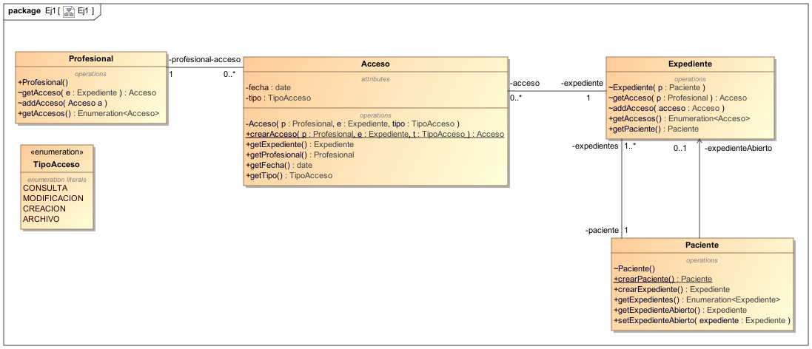
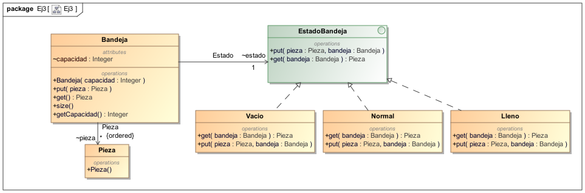

<!--Anotaciones de pie de página-->

[^1]: `java.util.Enumeration<T>` es una colección inmutable de Java
[^2]: https://google.github.io/styleguide/javaguide.html

<!-- Inicio del documento -->

# Preámbulo

El estilo de programación utilizado se rige por los normas de programación de
**Google Java Style Guide**[^2].

# Ejercicio 1: Expedientes médicos



Para la creación del modelo de diseño hemos usado la mayor parte del modelo de
dominio, modificando aquellos elementos que no puedan ser directamente
traducidos a Java o que pongan en peligro la consistencia del modelo.

La clase asociación Acceso ha sido reificada al ser la única forma de trabajar
con clases asociación en Java. Para mantener el mismo comportamiento descrito en
el modelo de dominio, hemos bloqueado el acceso al constructor y ofrecido en su
lugar el método público estático `crearAcceso()`. Este método se encargará de
actualizar los datos en un acceso ya existente o bien de crear una nueva
instancia de la clase Acceso. El resto de la interfaz pública está compuesta por
_getters_.

La clase Profesional no presenta grandes cambios, tan solo hemos limitado su
interfaz pública a lo esencial: Poder instanciar la clase y consultar los
accesos.

La clase Expediente ha sido restringida para evitar ser instanciada sin estar
asociada correctamente a un paciente, siendo necesario el método
`crearExpediente()` en Paciente para poder crear nuevos expedientes. Además, su
interfaz pública solo permite consultas sobre los accesos existentes y el
paciente al que está asociado

La clase Paciente tampoco tiene su constructor visible, sino que utiliza el
método estático `crearPaciente()` para generar nuevas instancias. Esto es así
para garantizar la consistencia del modelo: No podemos tener pacientes sin
ningún expediente, por lo que este método se encarga de generar un primer
expediente inicial y asociarlo al paciente. El resto de la interfaz pública está
compuesta por _getters_ para consultar el expediente abierto y todos los
expedientes actuales.

Valoramos la posibilidad de utilizar un patrón **factoría abstracta** con una
clase Hospital, encargada de los métodos `crearPaciente()` y
`crearExpediente()`. Terminamos descartando esta idea en favor del patrón
**método fábrica**, ya que los expedientes y los pacientes tienen alto
acoplamiento y no consideramos necesario introducir otra clase.

## Clase Profesional

### Interfaz pública

- `Profesional()`/_{Constructor}_
- `getAccesos()`/_{Getter}_: Devuelve una enumeración[^1] que itera sobre todos
  los accesos actuales que tiene el profesional

### Interfaz visible desde paquete

- `getAcceso()`/_{Getter}_: Dado un expediente no nulo, busca cuales de todos
  sus accesos le relaciona con dicho expediente y lo devuelve. En caso de no
  existir dicho acceso devolverá `null`
- `addAcceso()`: Registra el acceso no nulo recibido como parámetro en su
  colección de accesos

### Interfaz privada

- `acceso`/_{Attributes}_: Conjunto de accesos a los que el profesional tiene
  acceso

## Clase Acceso

### Interfaz pública

- `getExpediente()`/_{Getter}_: Devuelve el expediente asociado
- `getProfesional()`/_{Getter}_: Devuelve el profesional asociado
- `getFecha()`/_{Getter}_: Devuelve la fecha de registro
- `getTipo()`/_{Getter}_: Devuelve el tipo de acceso
- `crearAcceso()`/_{Static}_: Permite crear o actualizar los datos de acceso
  entre un profesional y un expediente. En el caso de que ya existiera un
  expediente entre ambas instancias, se actualiza la fecha y el tipo de acceso y
  se devuelve. En caso de no existir acceso previo, se crea una instancia de
  Acceso y se asocia al profesional y al expediente

### Interfaz privada

- `Acceso()`/_{Constructor}_
- `fecha`/_{Attributes}_: Fecha de registro
- `tipo`/_{Attributes}_: Tipo de acceso
- `expediente`/_{Attributes}_: Expediente asociado
- `profesional`/_{Attributes}_: Profesional asociado

## Clase Expediente

### Interfaz pública

- `getAccesos()`/_{Getter}_: Devuelve una enumeración que itera sobre todos los
  accesos existentes sobre el expediente
- `getPaciente()`/_{Getter}_: Devuelve el paciente al que pertenece el
  expediente

### Interfaz visible desde paquete

- `Expediente()`/_{Constructor}_
- `getAcceso()`/_{Getter}_: Dado un profesional no nulo, busca cuales de todos
  sus accesos le relaciona con dicho profesional y lo devuelve. En caso de no
  existir dicho acceso devolverá `null`

## Clase Paciente

### Interfaz pública

- `crearExpediente()`: Crea un nuevo expediente y lo asocia al paciente actual.
  Establece dicho expediente como el expediente abierto. Devuelve la instancia
  de expediente creada
- `getExpedientes()`/_{Getter}_: Devuelve una enumeración que itera sobre todos
  los expedientes asociados al paciente
- `getExpedienteAbierto`/_{Getter}_: Devuelve el expediente abierto
- `setExpedienteAbierto`/_{Setter}_: Sustituye el expediente abierto por el
  recibido como parámetro. El expediente debe o bien ser `null` (sin expediente
  abierto) o un expediente del mismo paciente
- `crearPaciente()`/_{Static}_: para crear nuevos pacientes. Se encarga de
  instanciar un nuevo paciente, instanciar un nuevo expediente para el paciente
  y asignarlo como expediente abierto del paciente. Devuelve la instancia de
  paciente creada

### Interfaz visible desde paquete

- `Paciente()`/_{Constructor}_

### Interfaz privada

- `expedienteAbierto`/_{Attributes}_: Último expediente asociado al paciente
- `expedientes`/_{Attributes}_: Conjunto de expedientes del paciente

## Enumeración TipoAcceso

Enumeración compuesta de las siguientes variantes: `Consulta`, `Modificacion`,
`Creacion` y `Archivo`

<!-- TODO ejercicio 2-->

## ej2 Apartado a

Basically la clase `MedioPensionista` tiene 2 relaciones de generalización: Una
con la clase Activo y otra con la clase Pensionista. En java no se permite la
herencia múltiple


# Ejercicio 3: Cadena de montaje.



Hemos creado el modelo de diseño basándonos en el modelo de dominio, aplicando 
elpatrón de diseño Estado: para ello hemos creado una interfaz `EstadoBandeja`, 
la cual es implementada por tres clases (estados) distintas: `Vacio`, `Normal` 
y `Lleno`. 

Una alternativa al modelo de diseño que hemos utilizado y nos planteamos
fue usar condiciones del tipo `if/else` en los métodos `get()` y `put()`
para así ir transicionando entre los estados, pero fue descartado
debido a la sencillez y escalabilidad del patrón Estado.

Se suelen comparar mucho los patrones Estrategia y Estado, y esto hizo
que nos plantearamos usar el patrón Estrategia. Su comparación viene dada 
porque funcionan de manera muy similar: pretenden modificar el funcionamiento
de un objeto en tiempo de ejecución de forma transparente a través de un
proceso de composición. La diferencia que los separa es el objetivo del
patrón Estrategia: proporcionar alternativas para realizar una misma
tarea. Es decir, el patrón estrategia es útil cuando queremos, por ejemplo,
serializar un objeto. Por tanto, Estrategia encapsula el algoritmo, mientras
que Estado encapsula un comportamiento que variará dependiendo del estado en 
el que se encuentre la ejecución, por estas razones fue que nos decantamos
por el patrón Estado.


La clase `Bandeja` no presenta grandes cambios con respecto al modelo de 
dominio, tan solo se ha limitado la visibilidad del atributo `capacidad` 
al paquete, manteniendo los métodos `put()` , `get()` y `size()` públicos.
Contiene atributos que hacen referencia a las clases Pieza y EstadoBandeja, 
siendo la referencia a la clase Pieza una **Queue** de piezas y a
EstadoBandeja uno de los tres estados que implementan la interfaz.

La clase Pieza no presenta ningún cambio, simplemente tiene un constructor 
que se encarga de instanciar la clase. 

La clase Vacio implementa la interfaz EstadoBandeja. Esta clase representa 
el estado de la clase Bandeja cuando se encuentra vacía. Tiene dos métodos: 
`get()` el cual lanza una excepción del tipo `IllegalStateException`, ya que 
no se pueden obtener piezas de una bandeja vacía y el método `put()` el cual
se encarga de añadir piezas a la bandeja y de transicionar del estado 
vacío al normal o al lleno, según la capacidad de la bandeja.

La clase Normal implementa la interfaz EstadoBandeja. Esta clase 
representa el estado de la clase Bandeja cuando no se encuentra ni vacía
ni llena. Tiene dos métodos: `get()` que se encarga de devolver el primer
elemento dentro de la lista de piezas y eliminarlo de la bandeja además
de transicionar a estado vacío si se quedara vacía la bandeja. El
método `put()`, que se encarga de añadir piezas a la bandeja y de
transicionar al estado lleno si la bandeja llegara a su límite
de capacidad.

La clase Lleno implementa la interfaz EstadoBandeja. Esta clase
representa el estado de la clase Bandeja cuando se encuentra 
en su tope de capacidad. Tiene dos métodos: `get()` el cual se 
encarga de devolver el primer elemento dentro de la lista de piezas
y eliminarlo de la bandeja además de transicionar a estado Normal. El
método `put()` simplemente lanza una excepción del tipo
`IllegalStateException`, ya que no se pueden añadir piezas a una
bandeja que se encuentra llena.

## Clase Bandeja
- `Bandeja(int capacidad)`/_{Constructor}_
- `put(Pieza pieza)`/_{Setter}_: Añade a la bandeja la pieza pasada por 
  parámetro.
- `get()`/_{Getter}_: Devuelve la primera pieza en la lista de piezas de la 
  bandeja.
- `size()`/_{Getter}_: Devuelve la capacidad de la bandeja.

## Clase Pieza
- `Pieza()`/_{Constructor}_

## Interfaz EstadoBandeja
- `get(Bandeja bandeja)`/_{Getter}_: Dada la bandeja por parámetro,
  devuelve la primera pieza dentro de la lista de piezas.
- `put(Pieza pieza, Bandeja bandeja)`/_{Setter}_: Añade a la bandeja
  pasada por parámetro la pieza pasada por parámetro.

## Clase Vacio (Implementa interfaz EstadoBandeja)
- `get(Bandeja bandeja)`/_{Getter}_: Dada la bandeja por parámetro,
  devuelve la primera pieza dentro de la lista de piezas.
- `put(Pieza pieza, Bandeja bandeja)`/_{Setter}_: Añade a la bandeja
  pasada por parámetro la pieza pasada por parámetro.

## Clase Normal (Implementa interfaz EstadoBandeja)
- `get(Bandeja bandeja)`/_{Getter}_: Dada la bandeja por parámetro,
  devuelve la primera pieza dentro de la lista de piezas.
- `put(Pieza pieza, Bandeja bandeja)`/_{Setter}_: Añade a la bandeja
  pasada por parámetro la pieza pasada por parámetro.

## Clase Lleno (Implementa interfaz EstadoBandeja)
- `get(Bandeja bandeja)`/_{Getter}_: Dada la bandeja por parámetro,
  devuelve la primera pieza dentro de la lista de piezas.
- `put(Pieza pieza, Bandeja bandeja)`/_{Setter}_: Añade a la bandeja
  pasada por parámetro la pieza pasada por parámetro.

# Código Java

## Ejercicio 1

### `Acceso.java`

```{include=src/main/java/ej1/Acceso.java}
```

### `Expediente.java`

```{include=src/main/java/ej1/Expediente.java}
```

### `Paciente.java`

```{include=src/main/java/ej1/Paciente.java}
```

### `Profesional.java`

```{include=src/main/java/ej1/Profesional.java}
```

### `TipoAcceso.java`

```{include=src/main/java/ej1/TipoAcceso.java}
```

## Ejercicio 2

### `Activo.java`

```{include=src/main/java/ej2/Activo.java}
```

### `MedioPensionista.java`

```{include=src/main/java/ej2/MedioPensionista.java}
```

### `Pensionista.java`

```{include=src/main/java/ej2/Pensionista.java}
```

### `Trabajador.java`

```{include=src/main/java/ej2/Trabajador.java}
```

## Ejercicio 3

### `Bandeja.java`

```{include=src/main/java/ej3/Bandeja.java}
```

### `EstadoBandeja.java`

```{include=src/main/java/ej3/EstadoBandeja.java}
```

### `Lleno.java`

```{include=src/main/java/ej3/Lleno.java}
```

### `Normal.java`

```{include=src/main/java/ej3/Normal.java}
```

### `Pieza.java`

```{include=src/main/java/ej3/Pieza.java}
```

### `Vacio.java`

```{include=src/main/java/ej3/Vacio.java}
```

## Tests JUnit

### Test Ejercicio 1

```{include=src/test/java/Ej1.java}
```

### Test Ejercicio 2

```{include=src/test/java/Ej2.java}
```

### Test Ejercicio 3

```{include=src/test/java/Ej3.java}
```