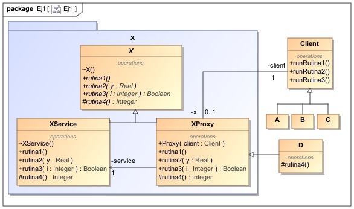

<!--Anotaciones de pie de página-->

[^1]: https://google.github.io/styleguide/javaguide.html
[^2]: https://en.wikipedia.org/wiki/Eiffel_(programming_language)#Scoping

<!-- Document start-->

# Preámbulo

Para la realización de esta práctica, hemos optado por utilizar un estilo de
programación estandarizado para el lenguaje de programación Java, conocido como
**Google Java Style Guide**[^1]

# Ejercicio 1: Los interfaces selectivos

## Apartado A

En Java contamos con los **modificadores de acceso** para exportar de forma
selectiva las distintas clases y atributos del sistema. Por ejemplo, para crear
una clase con visibilidad pública hacemos lo siguiente:

```
// Modificador de acceso público
// vvv
public class Ejemplo {/* ... */}
```

Los distintos modificadores de acceso son:

- **Visibilidad privada (`private`)**: Es la visibilidad más restrictiva. El
  elemento marcado con el atributo `private` será solo visible desde la clase en
  la que se declara.
- **Visibilidad de paquete**: Es la visibilidad por defecto de Java. Aquellos
  elementos que no han sido explícitamente marcados serán considerados visibles
  desde el paquete. Esto significa que el elemento se comporta con visibilidad
  pública en aquellas clases del mismo paquete, pero de forma privada con las
  clases externas al paquete.
- **Visibilidad protegida (`protected`)**: Al igual que la visibilidad de
  paquete, la visibilidad protegida impide que las clases externas accedan a
  aquellos elementos marcados con el atributo `protected`, aunque permite a sus
  subclases y clases del mismo paquete acceder a dichos elementos.
- **Visibilidad pública (`public`)**: Permite que el elemento marcado con el
  atributo `public` sea visible desde cualquier clase.

En la siguiente tabla se resumen las características principales de las
distintas visibilidades de Java:

| Modificador | Misma clase | Mismo paquete | Distinto paquete, subclase | Distinto paquete |
| ----------- | ----------- | ------------- | -------------------------- | ---------------- |
| Privado     | Sí          | No            | No                         | No               |
| De paquete  | Sí          | Sí            | No                         | No               |
| Protegido   | Sí          | Sí            | Sí                         | No               |
| Público     | Sí          | Sí            | Sí                         | Sí               |

El lenguaje Eiffel sin embargo profundiza más el mecanismo de exportación
selectiva,

otorgando al programador de un control modular sobre el acceso a los elementos
de las clases. Los distintos modificadores de acceso Eiffel, según la
Wikipedia[^2], son:

- **Visibilidad pública (`feature`)**: Al igual que en Java, permite que sea
  visible desde cualquier clase.
- **Visibilidad protegida (`feature {}`)**: Al igual que en Java, permite que
  sea visible desde sus propias
- **Visibilidad _selectiva_ (`feature {class1,class2,class3...}`)**: Permite que
  dicho elemento sea visible a los clientes seleccionados, actuando como privada
  para las demás clases

Podemos observar que ambos lenguajes tienen distintos modificadores de acceso;
Java incluye visibilidad **privada** y **de paquete**, mientras que Eiffel
incluye **_selectiva_**, siendo esta última un preciso que las demás
visibilidades. También se puede diferenciar entre ambos lenguajes según su
metodología para controlar el acceso: los modificadores de acceso de Java
dependen del rango (misma clase, subclases, paquete, fuera del paquete...) y los
modificadores de Eiffel dependen de quién intente acceder a ese
elemento/característica.

## Apartado B



Para solucionar el problema de las diferencias entre Java y Eiffel de los
mecanismos de exportación selectiva se debe controlar el acceso al servicio
y para ello utilizamos el Patrón **Representante** o **Proxy**.

Se generan así dos clases que hereden de la clase abstracta `X`; `Proxy` y
`XService`. Ambas implementan las operaciones de `X` y además `Proxy` contará
con un constructor al que se le pasan por parámetro un caller de tipo `Object`
y una referencia a un elemento de `X`. 

Las clases `A`, `B` y `C` se encontrarán en otro paquete para proteger el
acceso a los métodos de `X`. El último método (`rutina4`), por tanto, no
será visible para ninguna de estas tres clases al no encontrarse dentro del
mismo paquete, mientras que el primero (`rutina1`) será visible para todas
y las demás (`rutina2` y `rutina3`) depende de los accesos que se concedan
descritos en la clase `Proxy`.

# Código Java

## Ej1

### `A.java`

```{include=src/main/java/Ej1/A.java}
```

### `B.java`

```{include=src/main/java/Ej1/B.java}
```

### `C.java`

```{include=src/main/java/Ej1/C.java}
```

### `Proxy.java`

```{include=src/main/java/Ej1/Proxy.java}
```

### `X.java`

```{include=src/main/java/Ej1/X.java}
```

### `XService.java`

```{include=src/main/java/Ej1/XService.java}
```

## Ej3

### `DateSortStrategy.java`

```{include=src/main/java/Ej3/DateSortStrategy.java}
```

### `Email.java`

```{include=src/main/java/Ej3/Email.java}
```

### `FromSortStrategy.java`

```{include=src/main/java/Ej3/FromSortStrategy.java}
```

### `Mailbox.java`

```{include=src/main/java/Ej3/Mailbox.java}
```

### `Main.java`

```{include=src/main/java/Ej3/Main.java}
```

### `Priority.java`

```{include=src/main/java/Ej3/Priority.java}
```

### `PrioritySortStrategy.java`

```{include=src/main/java/Ej3/PrioritySortStrategy.java}
```

### `SortStrategy.java`

```{include=src/main/java/Ej3/SortStrategy.java}
```

### `SubjectSortStrategy.java`

```{include=src/main/java/Ej3/SubjectSortStrategy.java}
```

