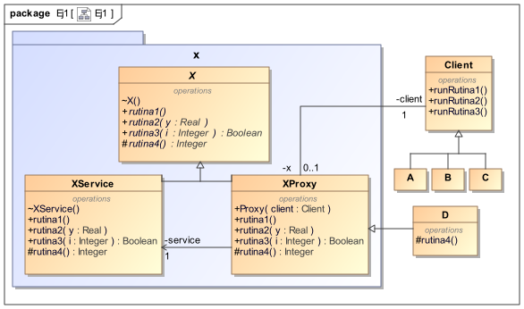

<!--Anotaciones de pie de página-->

[^1]: https://google.github.io/styleguide/javaguide.html
[^2]: https://en.wikipedia.org/wiki/Eiffel_(programming_language)#Scoping

<!-- Document start-->

# Preámbulo

Para la realización de esta práctica, hemos optado por utilizar un estilo de
programación estandarizado para el lenguaje de programación Java, conocido como
**Google Java Style Guide**[^1]

# Ejercicio 1: Los interfaces selectivos

## Apartado A

En Java contamos con los **modificadores de acceso** para exportar de forma
selectiva las distintas clases y atributos del sistema. Por ejemplo, para crear
una clase `Foo` con visibilidad pública escribimos lo siguiente:

```
// Modificador de acceso público
// vvv
public class Foo {/* ... */}
```

En Java, los distintos modificadores de acceso son:

- **Visibilidad privada (`private`)**: Es la visibilidad más restrictiva. El
  elemento marcado con el atributo `private` será solo visible desde la clase en
  la que se declara.
- **Visibilidad de paquete**: Es la visibilidad por defecto de Java. Aquellos
  elementos que no han sido explícitamente marcados serán considerados visibles
  desde el paquete. Esto significa que el elemento se comporta con visibilidad
  pública en aquellas clases del mismo paquete, pero de forma privada con las
  clases externas al paquete.
- **Visibilidad protegida (`protected`)**: Al igual que la visibilidad de
  paquete, la visibilidad protegida impide que las clases externas accedan a
  aquellos elementos marcados con el atributo `protected`, aunque permite a sus
  subclases y clases del mismo paquete acceder a dichos elementos.
- **Visibilidad pública (`public`)**: Permite que el elemento marcado con el
  atributo `public` sea visible desde cualquier clase.

En la siguiente tabla se resumen las características principales de las
distintas visibilidades de Java:

| Modificador | Misma clase | Mismo paquete | Distinto paquete, subclase | Distinto paquete |
| ----------- | ----------- | ------------- | -------------------------- | ---------------- |
| Privado     | Sí          | No            | No                         | No               |
| De paquete  | Sí          | Sí            | No                         | No               |
| Protegido   | Sí          | Sí            | Sí                         | No               |
| Público     | Sí          | Sí            | Sí                         | Sí               |

Por otra parte, el lenguaje Eiffel profundiza más en el mecanismo de exportación
selectiva, otorgando al programador de un control granular sobre el acceso a los
elementos de las clases. Los distintos modificadores de acceso Eiffel, según
Wikipedia[^2], son:

- **Visibilidad pública (`feature`)**: Al igual que en Java, permite que sea
  visible desde cualquier clase.
- **Visibilidad protegida (`feature {}`)**: Al igual que en Java, permite que
  sea visible desde sus subclases y clases del mismo paquete.
- **Visibilidad _selectiva_ (`feature {class1,class2,class3...}`)**: Permite que
  dicho elemento sea visible a las clases seleccionadas, actuando como privada
  para las demás clases.

Podemos observar que ambos lenguajes tienen distintos modificadores de acceso;
Java incluye visibilidad **privada** y **de paquete**, mientras que Eiffel
incluye **_selectiva_**, siendo esta última un preciso que las demás
visibilidades. También se puede diferenciar entre ambos lenguajes según su
metodología para controlar el acceso: los modificadores de acceso de Java
dependen del rango o alcance (misma clase, subclases, paquete, fuera del
paquete...) y los modificadores de Eiffel dependen de quién intente acceder a
ese elemento/característica.

## Apartado B



Para poder emular el mecanismo de exportación selectiva de Eiffel, debemos
controlar el acceso al servicio (la clase X) y para ello utilizamos el Patrón
**Representante** o **Proxy**.

Se generan así dos clases que hereden de una clase abstracta `X`; `Proxy`
(encargada de controlar el acceso) y `XService` (encargada de ofrecer el
servicio). `Proxy` contará, además de los métodos de X, con un constructor que
recibe como parámetro el objeto _caller_. La clase `Proxy` se encargará de
verificar si la clase _caller_ cuenta con los permisos suficientes para poder
realizar dicha llamada, y en caso contrario, lanzará una excepción de tipo
`IllegalCallerException`

Las clases `A`, `B` y `C` se encontrarán en otro paquete para proteger el acceso
a los métodos de `XService`. El método `rutina1` será visible para todos, los
métodos `rutina2` y `rutina3` serán visibles desde el exterior, pero su
ejecución solo será satisfactoria en caso de que la clase _caller_ cumpla los
requisitos establecidos. Por último, el método `rutina4` será solo accesible
desde las subclases

La ventaja que nos proporciona aplicar este Patrón es que las clases `A`, `B` y
`C` no interactúan directamente con `XService`, relegando el control del acceso
a la clase `Proxy` y dejando que `XService` únicamente se encargue de aplicar
los métodos. La desventaja que podemos observar es que al no existir soporte en
Java para el control granular de permisos, el acceso se comprueba en tiempo de
ejecución en vez de en tiempo de compilación.

# Código Java

## Ej1

### `A.java`

```{include=src/main/java/Ej1/A.java}

```

### `B.java`

```{include=src/main/java/Ej1/B.java}

```

### `C.java`

```{include=src/main/java/Ej1/C.java}

```

### `Proxy.java`

```{include=src/main/java/Ej1/x/Proxy.java}

```

### `X.java`

```{include=src/main/java/Ej1/x/X.java}

```

### `XService.java`

```{include=src/main/java/Ej1/x/XService.java}

```

## Ej3

### `DateSortStrategy.java`

```{include=src/main/java/Ej3/DateSortStrategy.java}

```

### `Email.java`

```{include=src/main/java/Ej3/Email.java}

```

### `FromSortStrategy.java`

```{include=src/main/java/Ej3/FromSortStrategy.java}

```

### `Mailbox.java`

```{include=src/main/java/Ej3/Mailbox.java}

```

### `Main.java`

```{include=src/main/java/Ej3/Main.java}

```

### `Priority.java`

```{include=src/main/java/Ej3/Priority.java}

```

### `PrioritySortStrategy.java`

```{include=src/main/java/Ej3/PrioritySortStrategy.java}

```

### `SortStrategy.java`

```{include=src/main/java/Ej3/SortStrategy.java}

```

### `SubjectSortStrategy.java`

```{include=src/main/java/Ej3/SubjectSortStrategy.java}

```
